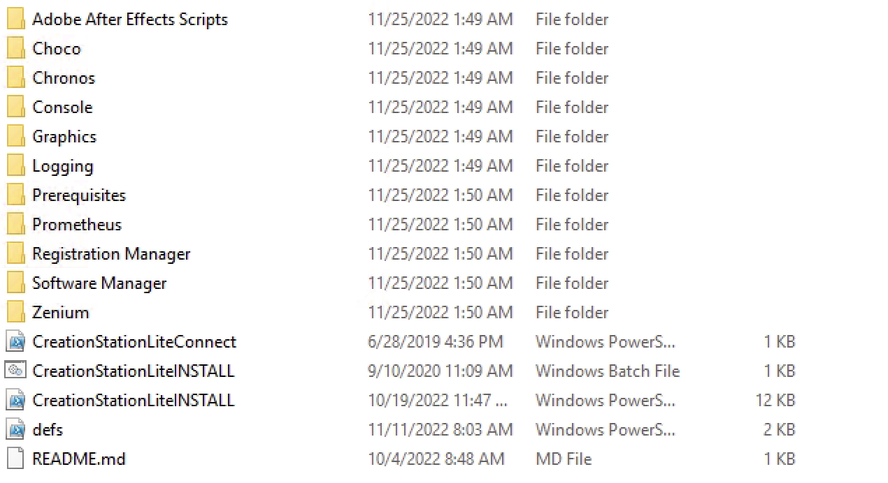
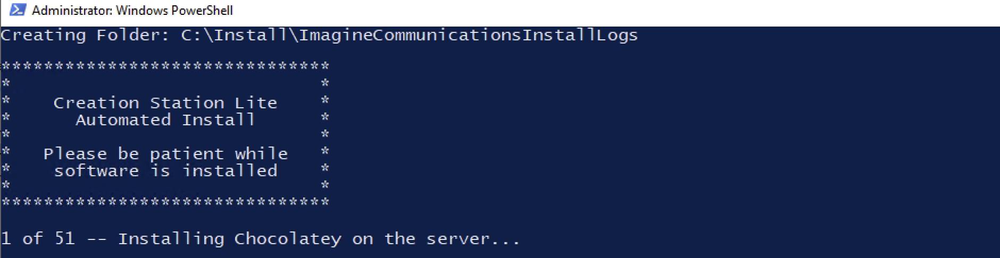
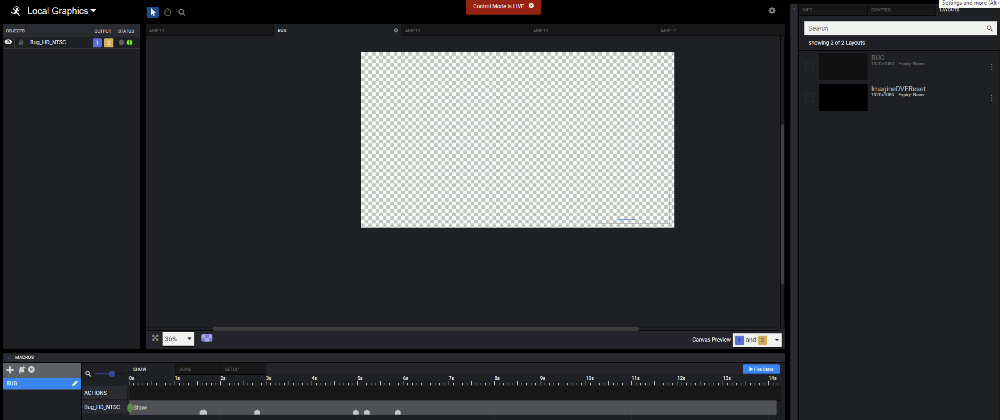
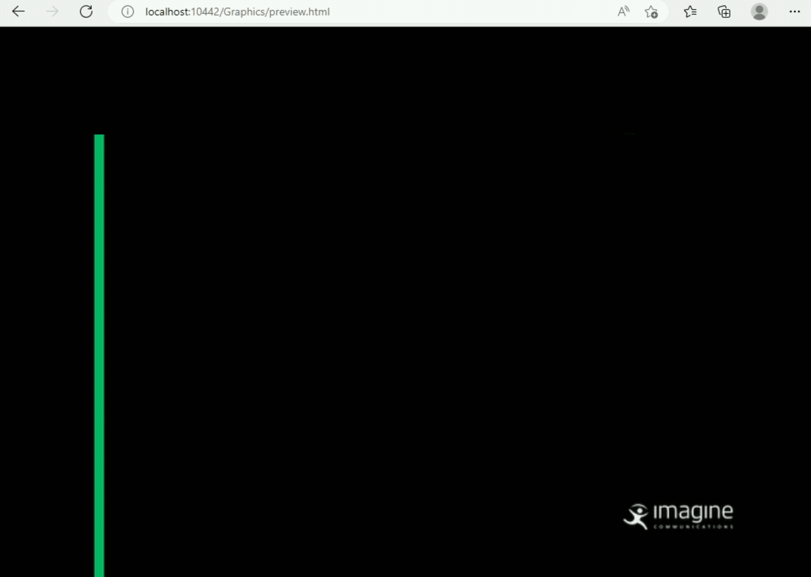
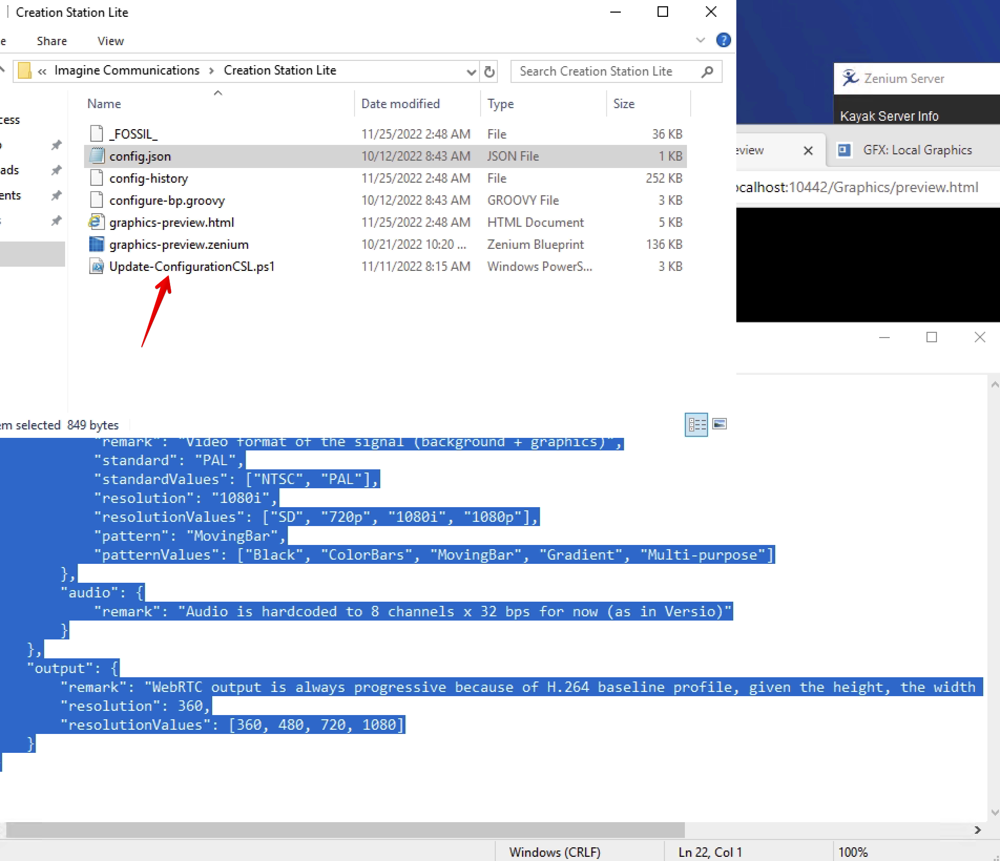

---
tags:
  - creation station 
  - install 
  - reference
---


<!--
Title : ref_4.7_creation_station_install
- Created : 2022-11-29
- Updated :
- Author : James Rivers
- Written against (version):
- Sources :
- Author Notes :
-->

!!! info "Article Detail"
    Written by James Rivers - Written Tue 29 Nov 2022 17:17:04 GMT

# Versio 4.7 Creation Station Install Reference

Locate the installer as part of the 4.7 release. 

!!! info
    For information the installer package is exactly the the same previous versions, run the `CrerationStationLite` install batch script as administrator and let the process continue.



   
!!! info
    What is the difference from this version to previous? There is a Zenium Blueprint that produces a Web RTC output. This solves the issue of having to use a Silverlight browser for the preview of graphics. 


## Versio Creation Station 4.7 Resource Requirement

To be determined, but it should not be far from the previous hardware and software requirements as detaile in the 4.3 release. 


## Install Steps

- Run the installation script from the Administrator shell. The machine will be rebooted a couple of times.




Install completed

- After the installation finished, launch the License Server Console from the start menu and make sure to activate a valid Zenium License.

!!! info 
    What license package do you need? This is yet to be determined. 

- Layouts can be imported or created into the IconStation. - Link - `http://localhost:10442/Graphics`



- To preview the graphic layouts, launch the respective shortcut on the desktop. - Link - `http://localhost:10442/Graphics/Preview.html`



## Configuration of CSL 4.7

With the Magellan Configuration page removed - how do we configure this CSL to be HD? NTSC?  Located at `C:/programdata/IC/Creation Station Lite/config.json` is our configuration file.

```json
{
    "program": {
        "video": {
            "remark": "Video format of the signal (background + graphics)",
            "standard": "PAL",
            "standardValues": ["NTSC", "PAL"],
            "resolution": "1080i",
            "resolutionValues": ["SD", "720p", "1080i", "1080p"],
            "pattern": "MovingBar",
            "patternValues": ["Black", "ColorBars", "MovingBar", "Gradient", "Multi-purpose"]
        },
        "audio": {
            "remark": "Audio is hardcoded to 8 channels x 32 bps for now (as in Versio)"
        }
    },
    "output": {
        "remark": "WebRTC output is always progressive because of H.264 baseline profile, given the height, the width will be calculated from the signal aspect ratio",
        "resolution": 360,
        "resolutionValues": [360, 480, 720, 1080]
    }
}
```
Use the PS script in that directory to apply the settings.


