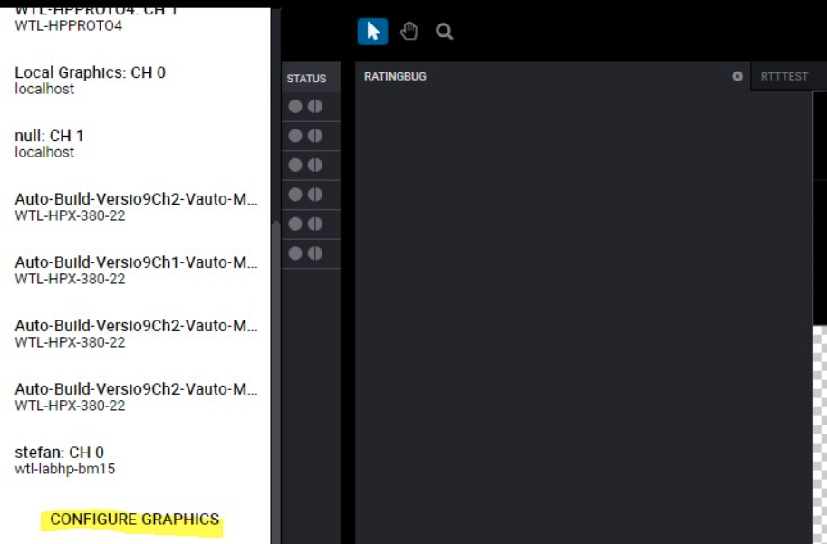
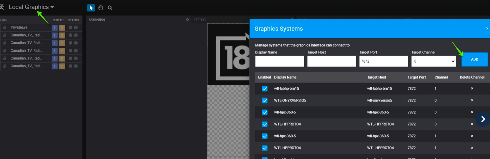
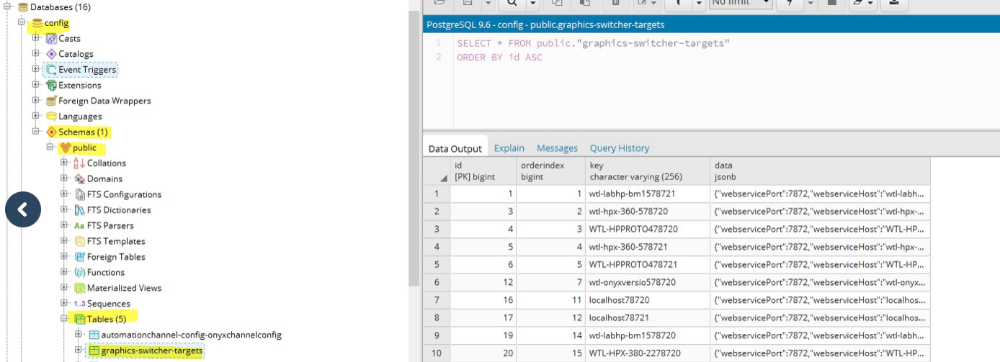

---
tags:
  - creation station
  - target
---

<!--
Title : ref_creation_station_target_selection
- Created : 2022-10-27
- Updated :
- Author : James Rivers
- Written against (version):
- Sources :
- Author Notes :
-->

!!! info "Article Updated"
    Thu 27 Oct 2022 10:50:11 BST
# Creation Station Target Selection

!!! success
    As part of [POPGM-2764](https://imaginecommunications.atlassian.net/browse/POPGM-2764) that encompassed [VMGMT-10767](https://imaginecommunications.atlassian.net/browse/VMGMT-10767) and [VMGMT-10766](https://imaginecommunications.atlassian.net/browse/VMGMT-10766) It is now possible to have a single web graphics page (html5) and connect to multiple icw-iconstation web services. This was validated in prometheus-ui.1.4.0.304.

Internal video only:
<iframe src="https://player.vimeo.com/video/764492814?h=f84f292982" width="640" height="360" frameborder="0" allow="autoplay; fullscreen; picture-in-picture" allowfullscreen></iframe>

## Adding connections

Top left click on the drop down and select `configure graphics`

Once you have added the details this is saved to the postgreSQL `config` DB 

