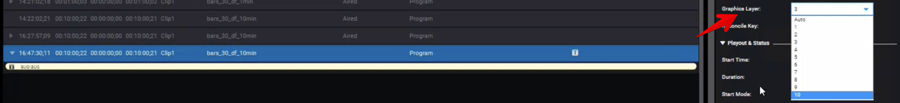
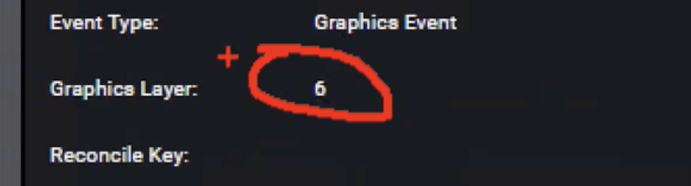
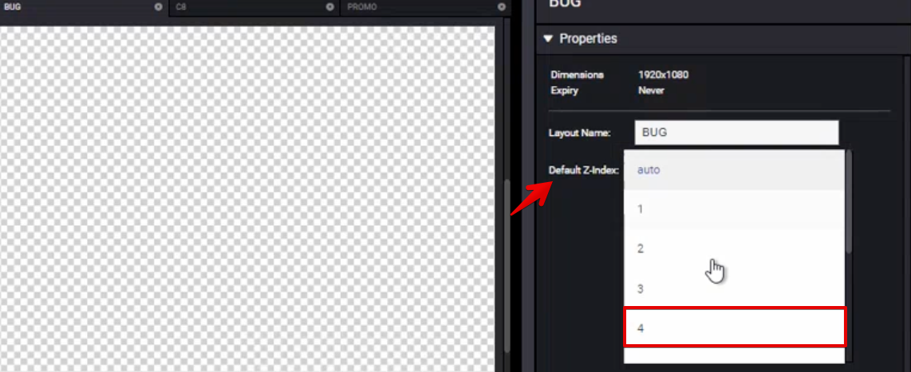
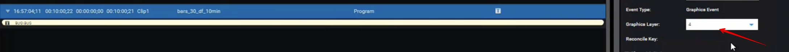

<!--
Title : tut_layout_z-order
- Created : 2022-07-18
- Updated :
- Author : James Rivers
- Written against (version):
- Sources :
- Author Notes :
- Tags : 
-->

# Layout Z-Order

It is possible to add the layout `z-order` properties whilst you create the layout in the Creation Station. 

In the past we have been able to set the layer to air the graphic from the Versio Automation - we still can.

But we can also set the preferred layer to use for the layout when we create the layout in the creation station:

Anytime this layout is manually added to the scheudle it will inherit the preferred layer number. 

> Note that if you schedule for the layout to be aired on layer 9, not the preferred layer it will air on layer 9. - Schedule wins!

