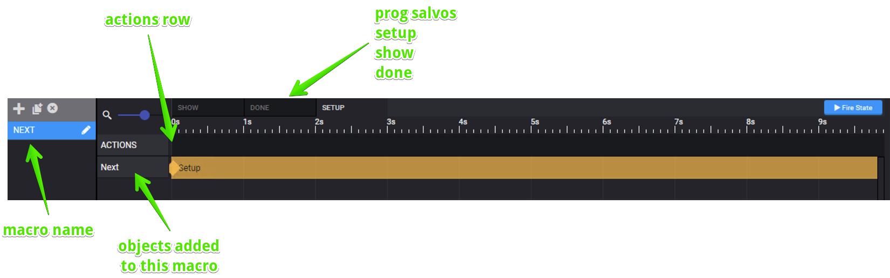
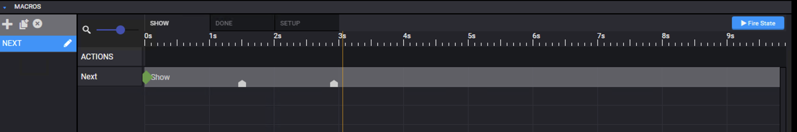
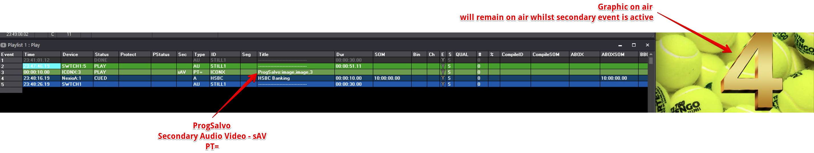
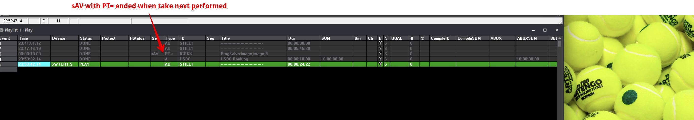
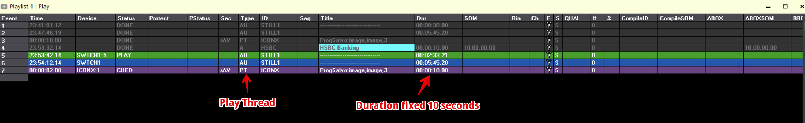
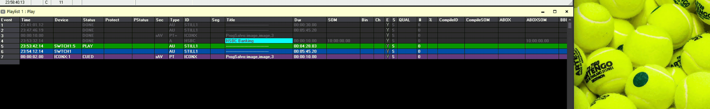

---
tags:
  - adc
  - automation
  - prog salvo
  - secondary
---

<!--
Title : ref_prog_salvo
- Created : 2022-11-07
- Updated :
- Author : James Rivers
- Written against (version):
- Sources :
- Author Notes :
-->

!!! info "Article Updated"
    Mon  7 Nov 2022 07:23:19 +08
# Secondary Events - ADC Automation - Prog Salvo

What is a prog salvo?

!!! info 
    ProgSalvo allows you to fire graphics based on a duration in the schedule instead of the length of graphics. Graphics must be built with 3 salvos: 
- SalvoName-SETUP
   - Prepares the graphics for on air readiness. Optional
- SalvoName-SHOW
   - The on salvo for showing the graphics or firing triggers
- SalvoName-DONE
   - The off salvo for hiding the graphics or firing triggers

## Setup

A Layout is loaded 3 seconds before (or whatever the pre-roll time is) and the salvo `-SETUP` is fired.

Whatever is included in the `setup` salvo will be triggered. This is generally the setup funtion and any commands:

## Show 

A Layout will be taken to air at the time of the secondary event in the schedule and the `show` salvo will be triggered and all contents in that salvo:

## Done

When will this be triggered? It will be fired on the following examples:

- sAV with a `PT=` and no duration

- operations performs a take next, secondary event is closed as it was `PT=`

- sAV with a PT and a fixed duration 

- Duration is reached and secondary is cleared down

