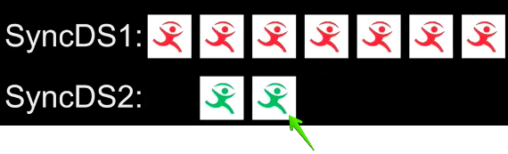
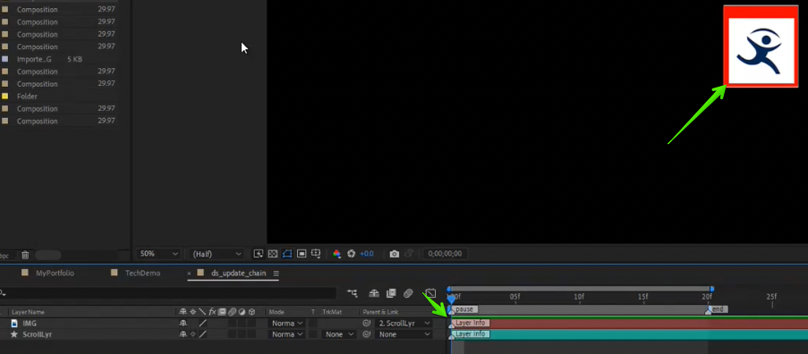
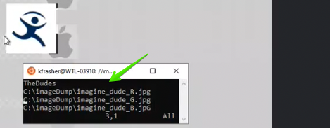
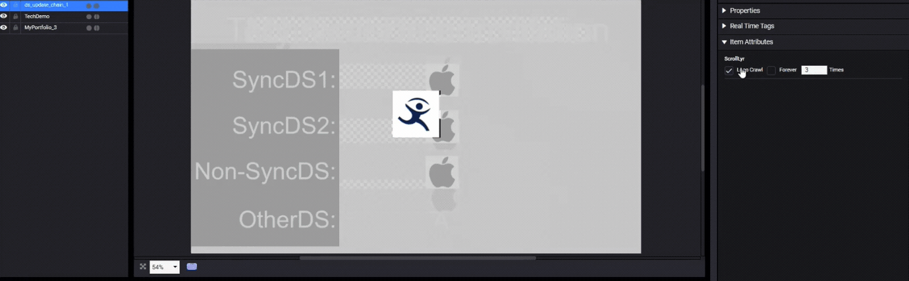

---
tags:
   - crawl
   - scroll
   - realtime
---

<!--
Title : 2114433994_creation_real_time_scrolls_crawls_howto

- Created : 2022-01-06 14:30
- Updated :
- Author : James Rivers
- Written against (version):
- Sources :
- Author Notes :
-->
!!! info "Article Updated"
    Tue 25 Oct 2022 10:16:30 BST

# How to create real time scrolls 
Scrolls consist of various scroll items that will either roll vertically or crawl horizontally in the layout.

- Create a Shape Layer,  use the Rectangle tool to draw the scroll's "leading rectangle."
- The leading rectangle will not actually appear in your scroll. Instead, it defines the behavior of your scroll in many ways:
	- Direction and Speed of Scroll: The way you animate the leading rectangle (its animation direction and its speed) will determine the direction and speed of your scroll items
	- Pause Movement: The animation will also determine the amount of vertical or horizontal movement on a CTC pause marker.
	- Arrangement of Scroll Items: The distance of the scroll items in relation to the top-left corner of the leading rectangle can be used to imply a margin separating subsequent scroll items, and to organize the way components appear relative to each other.
	- Visual Aid: The leading rectangle can also be used as a visual aid to represent typical scroll data.

- Apply the the Scroll label to the leading rectangle.
- Add your Real Time items:
	- Using the Horizontal Type tool or the Rectangle tool, create text or shape layers to represent your scroll items and any other Real Time items. 
	- Label the items with the RealTime label. 
	- Set the Parent property of all scroll items to be your leading rectangle layer. 

- The distance between the scroll items and the rectangle edge will determine how the scroll items are spaced during output.
- We are interested in the distance from the top left corner of the rectangle and the top left corner of the text layer. 

 

When the scroll is played within Versio Platform, the scroll items will be spaced accordingly:

If the scroll is a crawl, however, then the distance between the left edge of the rectangle and the left edge of the first scroll item will determine the space between all items in the crawl.

When the scroll is played within Versio Platform, the scroll items will be spaced accordingly:

> Note: The above examples show a roll that moves from bottom to top and a crawl that moves from right to left. Rolls and crawls can move in the opposite directions if desired.

### Direction 
Animate the leading rectangle to set the direction and speed of the scroll.

If the leading rectangle is animated to move vertically faster than it moves horizontally, then the scroll will be treated as a roll. Otherwise, it will be a crawl. 

- Scroll items will move in the same direction that the leading rectangle moves.
- The first frame in the position animation is the important element and dictates which direction the crawl or roll is going. To be clear the difference between frame 1 and frame 2 cannot be zero on position. 

- The speed of the rectangle's animation will determine the speed of the scroll items.
- You can also animate the scroll items. Their transformations will occur as they scroll during output.
- During playback the items will scroll until the the end of the AE animation, and then the scroll will stop. If you will be connecting your scroll items to a data source, you will generally want to allow the scroll to continue until the data has been completely displayed.
- You can do this by putting a pause point in the animation. When the pause point is reached, the items will continue to scroll until there are no scroll items left (because the data has all been displayed), and then the animation will resume.
- Add a composition marker
- In the Comment box, enter a label for the pause (example: pause).
- Also in the Comment box, enter the following command and then click OK:
hold = true
- If you do not do this the crawl will freeze on the at the end of the comp time on air - not what you want. 
- This is also known as a `hybrid pause`
- Or known as stateful.

- Run the RealTime Scripts

- Render the comp
- Add the mov to a new layout and edit the real time tags

You should note that the crawl does not freeze on the last frame of the 5 second comp we created.  

I have added a frame count to prove this point, the frame count should pause but the crawl should complete and finish.

If we want to loop forever in a crawl then we need to add those attributes.  In the CSL layout select the object and click on the info column, find the item properties and set the crawl to loop forever. 

### Adding External Data to the Crawl
Instead of us adding static text to the real time field in Versio Graphic. Lets link the real time field to an external data source. In this example I am pulling a news rss feed into data sourcerer, then selecting the data that I want to populate in the RT field. 

IconStaion is talking to Data Sourcerer to fetch all that external data. What is Data Sourcerer? Please review [2083402020_what_is_data_sourcerer_explanation](../chapter01_what_is_versio_graphics_and_how_they_are_used/2083402020_what_is_data_sourcerer_explanation/2083402020_what_is_data_sourcerer_explanation.md)

> Note a loop will just play out the same data that has already been captured from Data Sourcerer and displayed. If we want new data, then we will have to add in a `pull` into the comp as another xmp marker to pull new data from the data sourcerer. 

> Wireshark capture string - host 172.16.1.120  && port 6474 on the ethernet adapter used.

### Multiple Crawls
It is possible to have multiple crawls in the same composition.  Plus have them linked to differing data sources.  

We always scale to the length of the longer text. 

### Geometry 
Geometry items such as rotation and scale are supported.

## Active Textrues in Crawls?

Sure you can add active textures to your crawls we treat them the same as text objects. An active texture item could be that graphic seperator between stores right?  The image below is a series of imagine logos (active textures) in a crawl. 

!!! bug
    Active textures only display in crawls when looping infinitely. If you say loop N times you also get some active textures and does not display as intended. If you say play once, you get no active textures. Additionally, if we have a crawl with multiple data sourced image sets we noticed that it is not properly looping all these images together. What should happen? The active texture should display for every scroll item regardless of the looping or loop count.

!!! success
    VMGMT-10607, VMGMT-15870 and VMGMT-15193 part of POPGM-4186 have resolved this issue. The videos below, show this in action. 

<iframe src="https://player.vimeo.com/video/764464413?h=48f505daa4" width="640" height="360" frameborder="0" allow="autoplay; fullscreen; picture-in-picture" allowfullscreen></iframe>

<iframe src="https://player.vimeo.com/video/763777291?h=641eb6efc3" width="640" height="360" frameborder="0" allow="autoplay; fullscreen; picture-in-picture" allowfullscreen></iframe>

### Adding Active Textures

Simply add a sample image for the texture that is the same size as that of what you will replace the realtime item with in the future. 

Once added run the realtime script and render the composition. 

Once you have added this .mov to a layout you can link the realtime active texture to a path and item that can be seen by the Versio. 

### Adding Active Textures - Multiple Crawls - Textures in Sync

Improvements have been made to how we show multiple active textures across multiple crawls. A new feature for texture sync has been added, the review video walks you through this new option. 

!!! note
    This only works on media objects that are referenced data sources and part of crawls

<iframe src="https://player.vimeo.com/video/763792033?h=908395eb4c" width="640" height="360" frameborder="0" allow="autoplay; fullscreen; picture-in-picture" allowfullscreen></iframe>

