---
tags:
  - realtime
  - clocks
  - counters
  - timers
  - reference
---

<!--
Title : ref_realtime_clocks_timers_counters
- Created : 2022-10-28
- Updated :
- Author : James Rivers
- Written against (version):
- Sources :
- Author Notes :
-->

!!! info "Article Updated"
    Fri 28 Oct 2022 15:38:12 BST

# Reference - Real Time - Clocks Counters Timers
!!! success 
    Real Time Clocks and Counters have introduced in versions versio-graphics 18.1.0.310, icw-iconstation-web-service 0.4.1.99 and prometheus-ui 1.2.0.212

!!! info 
    Realtime timers adopt a hybrid pause approach. Add your frame counter to this comp you can see why. 

## How to create clocks timers counters
### Clocks
Working in After Effects - new comp. 

 On the composition add a new text layer, add the text hh:mm:ss

- rename the later to time or something that you can identify later
- Set the  label for the text layer to be `Time` this important!
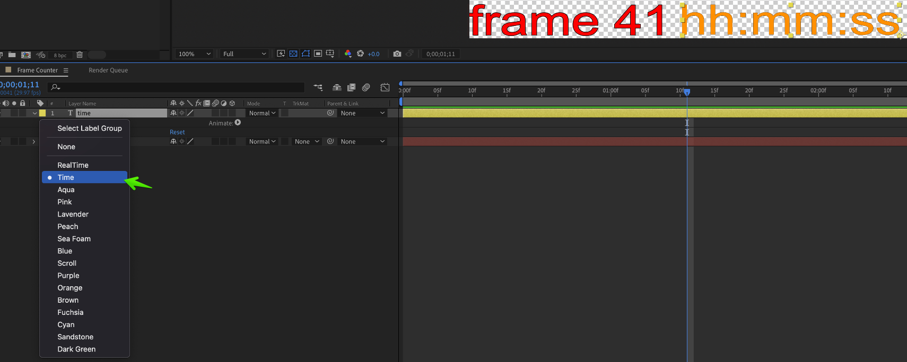
!!! info 
    Other options are available see below

|Symbol|What is substituted in its place|
|:----|:----|
|s or ss|seconds|
|ms|milliseconds|
|m or mm|minutes|
|h or hh|hours|
|AMPM|localized meridian if the RT Time is configured to be a 12 hour clock|

Run the **realtime** script
Add a pause xmp comp marker

Users will usually want to keep their timers or clocks ticking longer than the duration of the clip. When Versio detects a RT Time object it will continue to generate frames on a pause point. As a result, the clock or timer can keep ticking indefinitely.

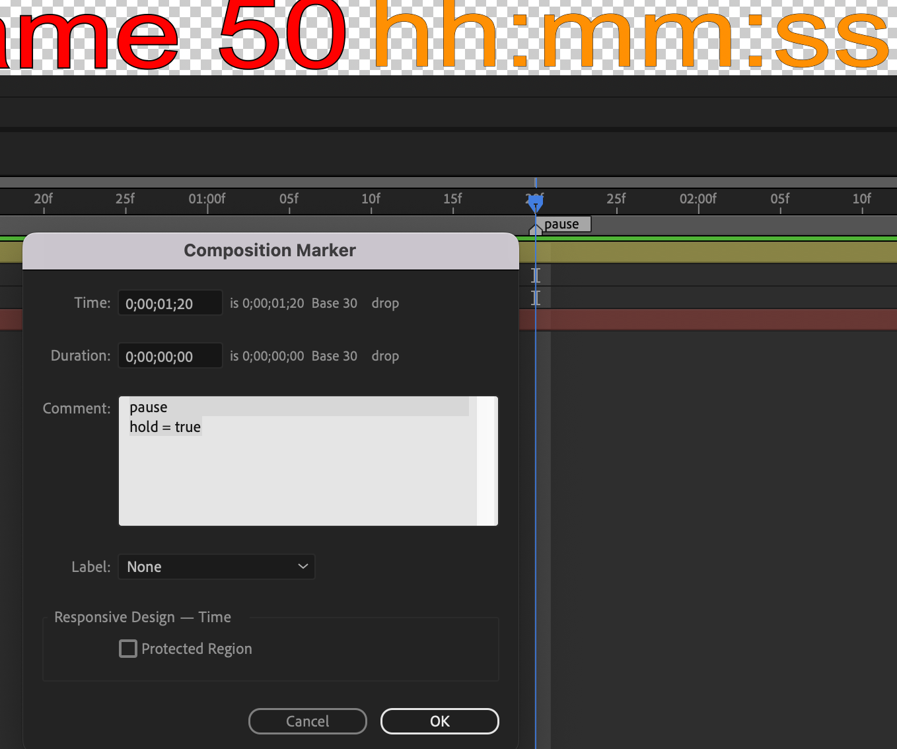

Render the composition

!!! warning 
	 Non-formatting characters such as colons and decimals are not substituted and will appear on output unchanged. 

!!! fail 
	 we do not support clocks or timers that consist of _only_ `mm` characters. If you include minutes in your clock or timer you must also include other formatting characters.

Create a new layout and add the rendered composition to the layout. 
 
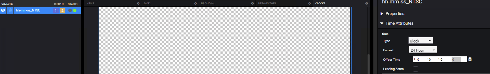

!!! note 
	 By default, all `Time` objects are configured as 24 hour clocks.

Clocks can be configured to be `24 hour` or `12 hour`.

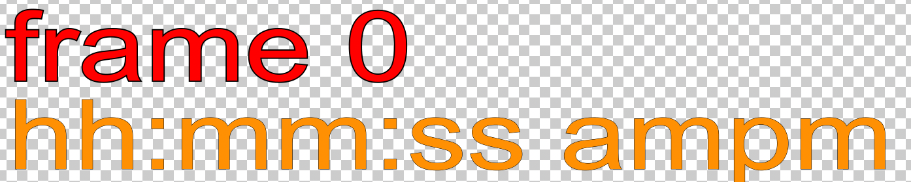

!!! note
	 The AMPM token is substituted only when the 12 hour option is selected.
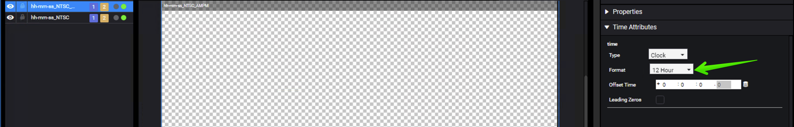
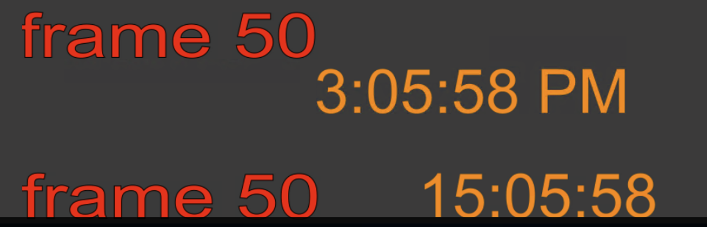

Versio will query any configured TimeCode Device for the time, and otherwise use the Local Time.

The `Offset Time` is added to or subtracted from the retrieved time. The sign of the offset can be changed by clicking on the `+` symbol.

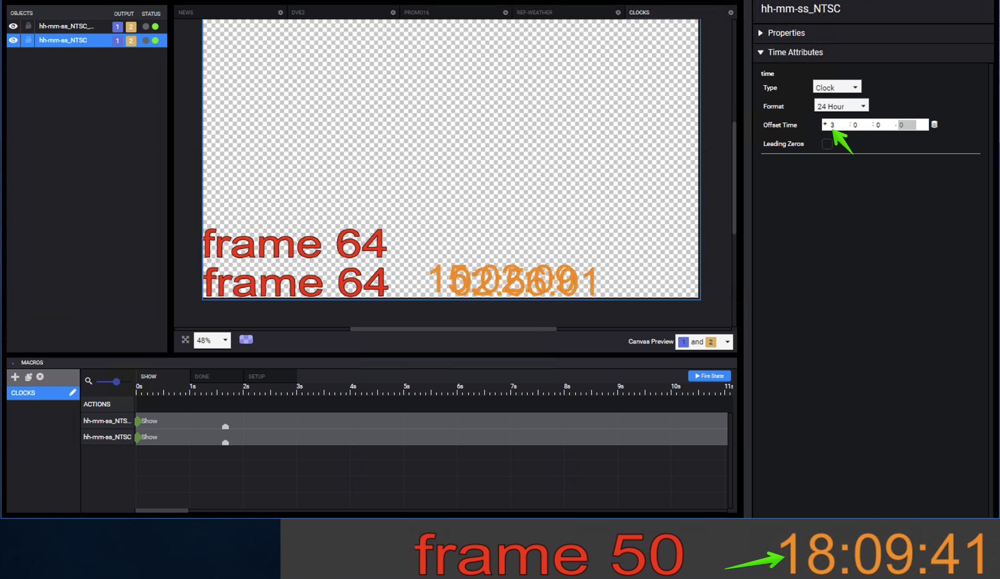

The Leading Zeros check box determines whether or not the most significant format digit is prepended with zeros whenever its value is shorter than the format string it corresponds to.

!!! warning 
	 Something that we need to be aware of regards time and setup.  If we setup the layout with a clock, then we are fetching the data required from the source, Chronos or the PC time. But if we then perform a show, after the setup we will see stale data and clock time be listed incorrectly until it can catch up. Here is an example of that behavior. A jump from 06.28.10 to 06.28.16. To avoid this on air issue, add opacity to the text layer for the first few frames so this error is not shown. 
	
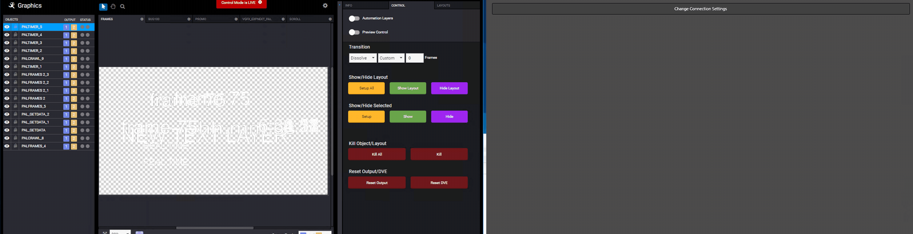
 
### Timers

Timers are configured by the `Type` "`Countdown to time`" or "`Count to/from time offset`".

#### Countdown

The option Countdown to time can be used to output the difference between the current time and next occurrence of the specified time, or the (always decreasing) difference between the current time and a specified time at a specified date. For example, a timer configured in this way:
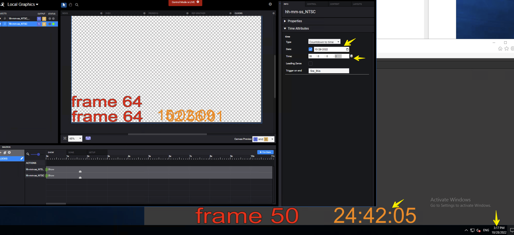

!!! note 
	 The `Date` checkbox only appears if the formatting characters corresponding to this RT Time only contain time characters rather than a date. (If a date is specified the date portion is mandatory.)

#### Count To / From

If the `Count to/from time offset` is specified, the timer will count the difference between the start time and a relative time in the future, or it will count up perpetually if the specified time is zero. 

In the following case, the timer will start with an output of "0:00:00.000" and progress up to 10 hrs at which point it will fire the `fire_this`.

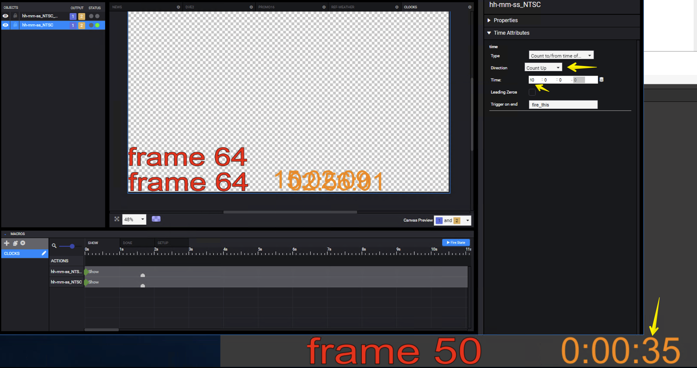

In this example, the timer will start with an output of "0:15:00.000" and decreasingly progress to 0 at which point it will fire the trigger.

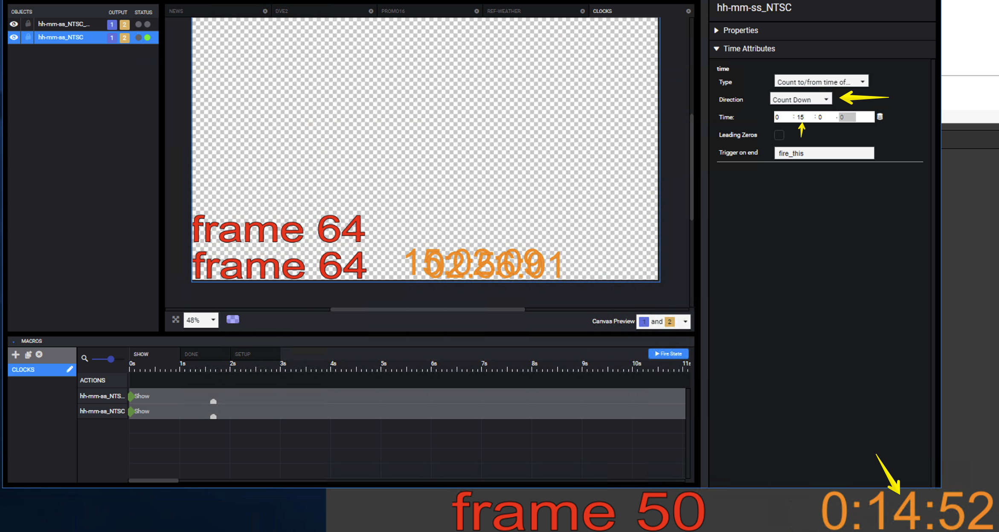

In the following case, the timer will count up from zero indefinitely

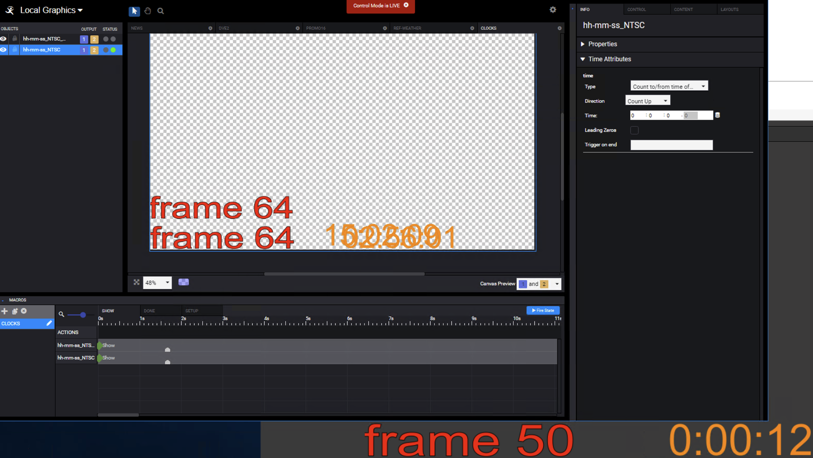

!!! tip 
	 Timers/ clocks can be built in a hierarchal manner. Here is an example, we are going to break up the hh, mm and ss into 3 text layers. 

### Dates

As with time formats, create a text object with the type tool in After Effects and enter a date with the following formatting characters:

|Symbol|What is substituted in its place|
|:----|:----|
|yyyy or yy|year or number of years|
|mm or m|month or number of months|
|dd or d|day or number of days|
|mmmm|localized long month, such as "January"|
|mmm|localized short month, such as "Jan"|
|dddd|localized long day, such as "Tuesday"|
|ddd|localized short day, such as "Tue"|

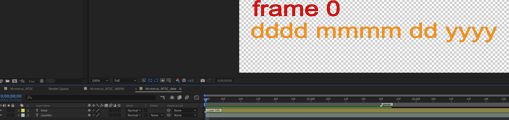

As with clocks, date formats are evaluated with the current date by default (rather than being a timer). The above would yield the following output:

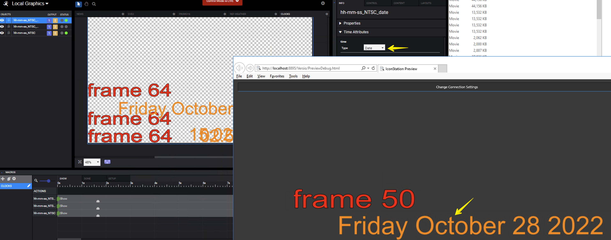

### Date and Time 

Date formatting characters and time formatting characters cannot be specified as part of the same After Effects text object because the "mm" is ambiguous.

!!! success
	 Create two After Effects text objects instead and give them the same layer name. To act as one logical timer, both date and time formatting strings must correspond to a RT Time field of one name. The same is recommended for clocks and dates, even if they have the default configuration. For example:

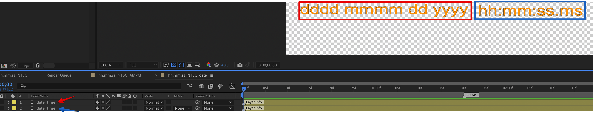

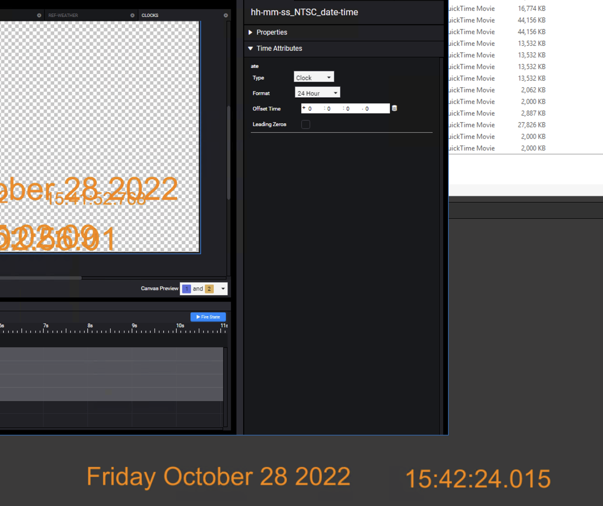

!!! tip 
	 the following is useful - dd hh:mm

Note that not all formatting characters need be specified. In the above case, the date portion consists of only "dd", while the timer portion consists of "hh:mm
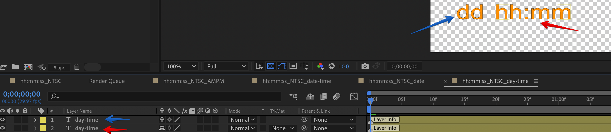

The two After Effects text objects named dayTimer act like one logical RT Time field everywhere in Versio. When configured as a timer:

7 is number of days

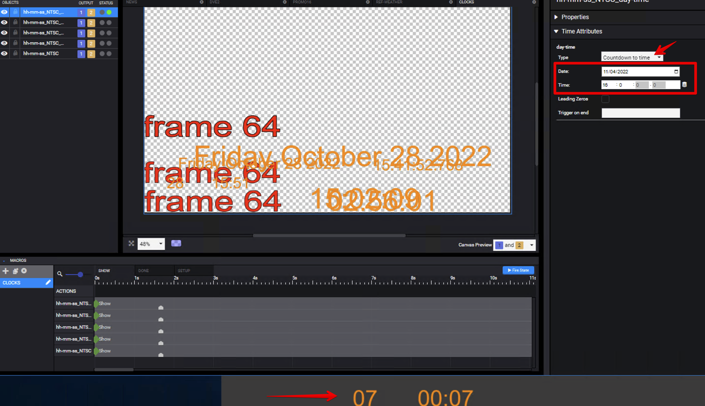

### Hierarchal build. 
Timers/ clocks can be built in a hierarchal manner. Here is an example, we are going to break up the hh, mm and ss into 3 text layers. 
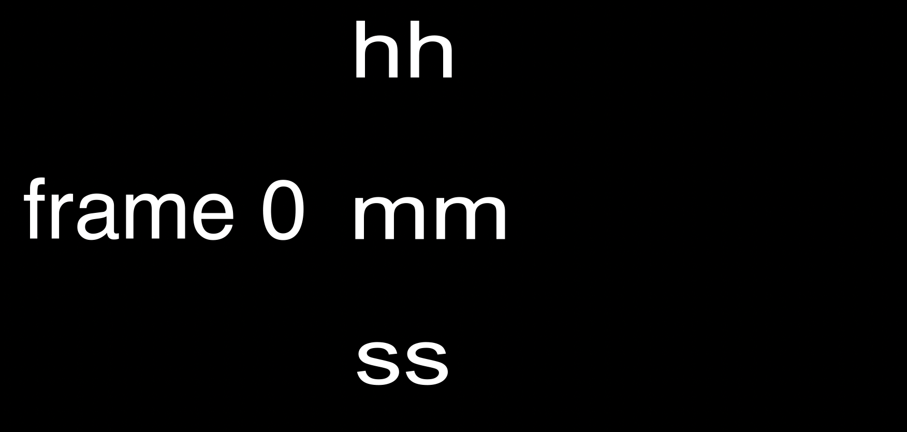

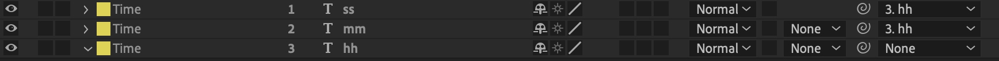

In the above case, the field "`hh`" is the parent of the other fields. The transformations applied to `hh` are applied to `ss`, `mm` and `hh`, but each subordinate field can have its own transformations as well. 

!!! warning 
	 Note: the parent cannot consist of solely the `hh` formatting characters. It must either be combined with some other formatting characters or not be the hierarchical parent.

Both date and time hierarchies can be combined provided that the parent fields are of the same name. For example:

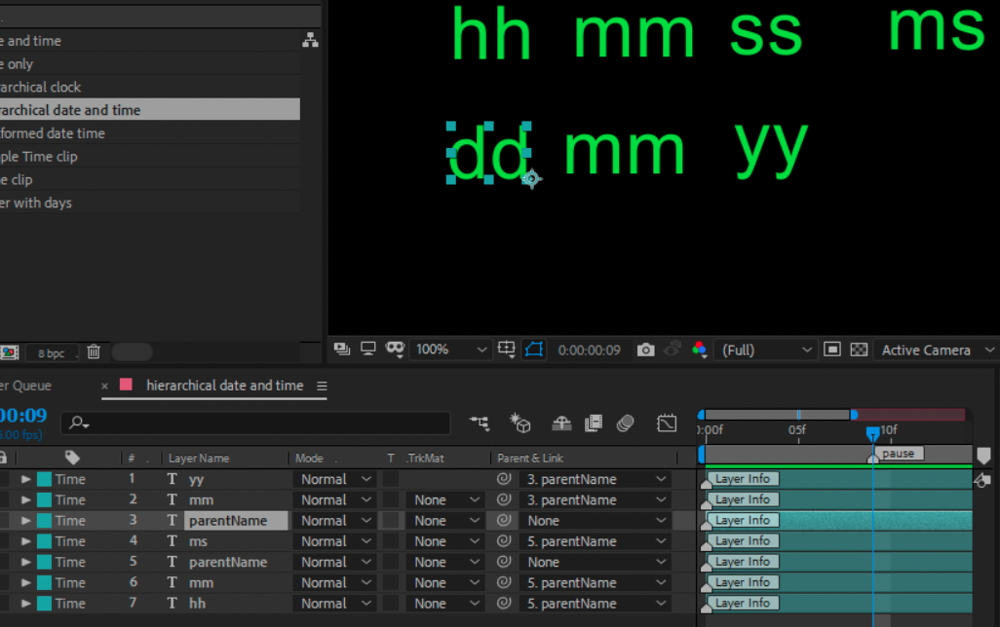
Here the RT Time field numbered 3 and named `parentName` contains the `dd` formatting characters and is the parent of fields `yy` and `mm`. The RT field numbered 5 and named `parentName` is the parent of the remaining fields.

We can think of `parentName` as being two parallel hierarchical roots of the same name.
!!! note
	 as previously, neither hierarchical parent may contain _solely_ the `mm` formatting characters

### Clocks and Timers on a Null Parent
A single RT Time field or a hierarchical tree or like-named pair of trees can have a RT Null field as a parent. For example:

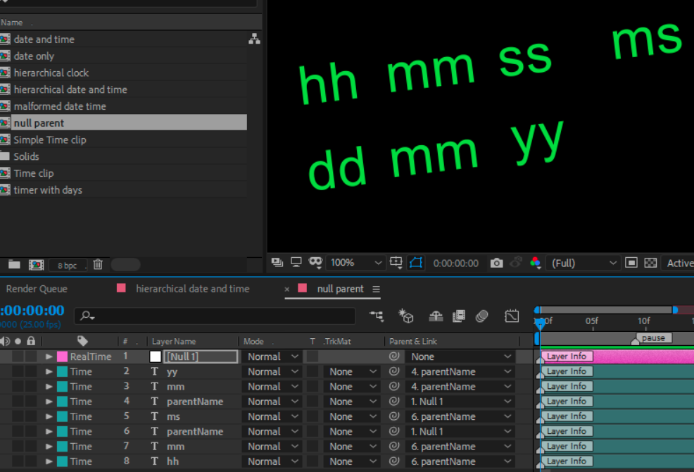

Here, all date and time components have been rotated by one null object transformation.

## Exclusion Text
If you want to add text other than a period or colon to a clock or timer it is a good idea to exclude it by putting it in square brackets as follows:

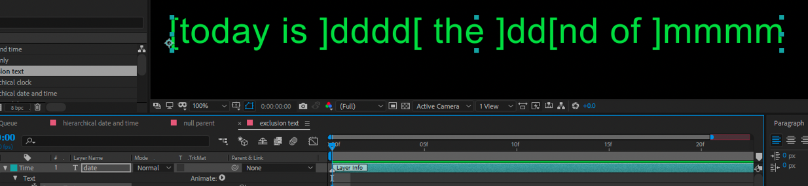

This clip produces the following output:

The value of the `date` field contain three exclusion sections. If the text were not excluded, the rendering engine would substitute the d and y in 'today' and the d in 'nd', making the resulting clock unlikely to be useful.

### Count Down to Event - Versio Automation

Set the Countdown to a countdown variable as shown here:

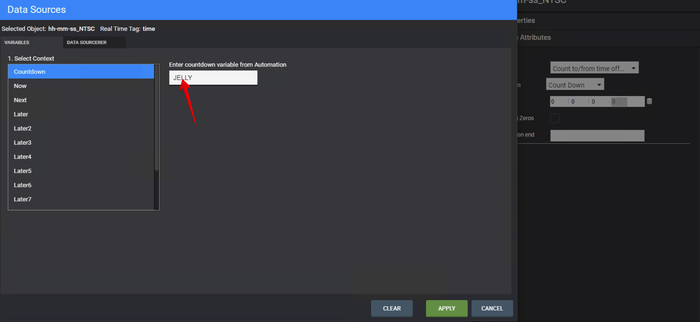

The Variable is `JELLY` it could be anything.

In the Versio Automation schedule, set the countdown variable `JELLY` on the event you want to count down to:
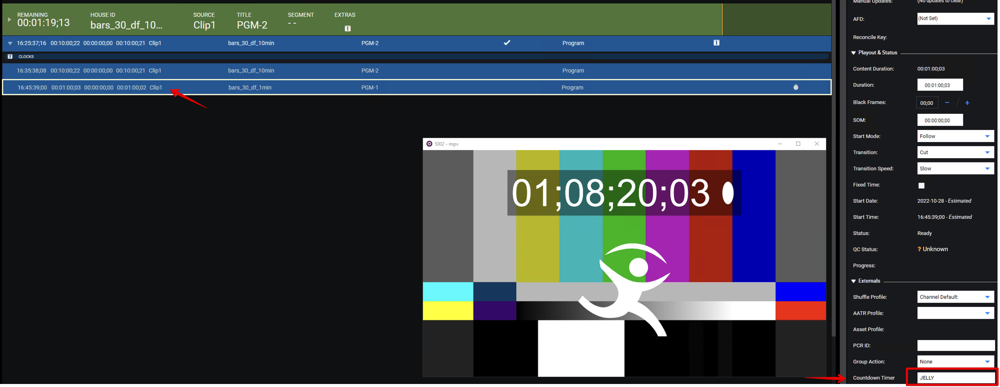
Now, taking the graphic to air, we have a count-down to that event - `JELLY`

!!! warning 
	 you need to have enabled this countdown feature... 

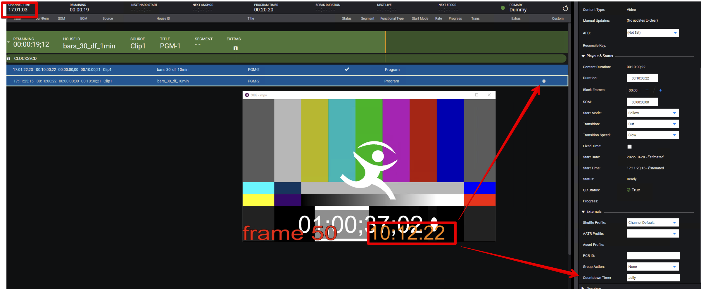

