---
tags:
  - vectors
  - shapes
  - masks
  - realtime
---

<!--
Title : ref_realtime_vector_shapes_masks
- Created : 2022-10-27
- Updated :
- Author : James Rivers
- Written against (version):
- Sources :
- Author Notes :
-->

!!! info "Article Updated"
    Thu 27 Oct 2022 08:49:18 BST
# Reference - RealTime Vector Shapes and Masks

<iframe src="https://player.vimeo.com/video/764456084?h=8f08809e76" width="640" height="360" frameborder="0" allow="autoplay; fullscreen; picture-in-picture" allowfullscreen></iframe>

## Steps & Walk-through

- Create a new composition in After Effects
- Select the pen tool 
- Create a path on the canvas
- Click on the last vertex to create the shape

!!! tip
    you can also right click the shape and select close

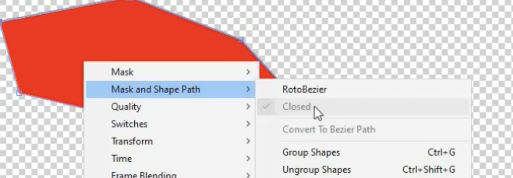

- Add `bezier` curves, right click on the shape and select `RotoBezier`

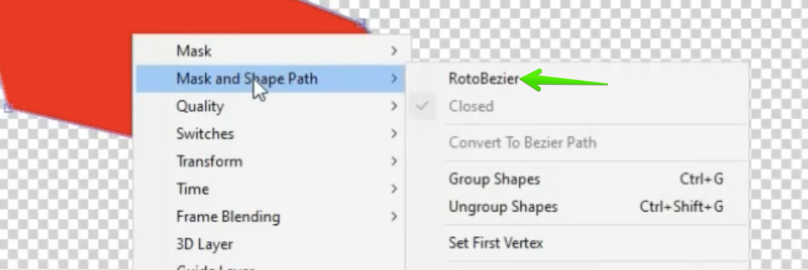

!!! info "What is Bezier?"
    What RotoBezier does is it eliminates the handles. All you need to do is click a few points in a window and After Effects will automatically calculate a smooth path between them. You don't need to drag handles while you're drawing.

- With the pen tool still select we can move the vertices on the shape to any position.

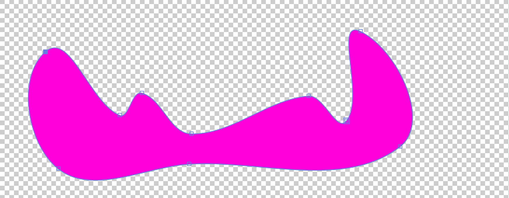

- We can change these tangents if we need to, simply go back to the `RotoBezier' option and de-select, the adjust the tangents as needed. 

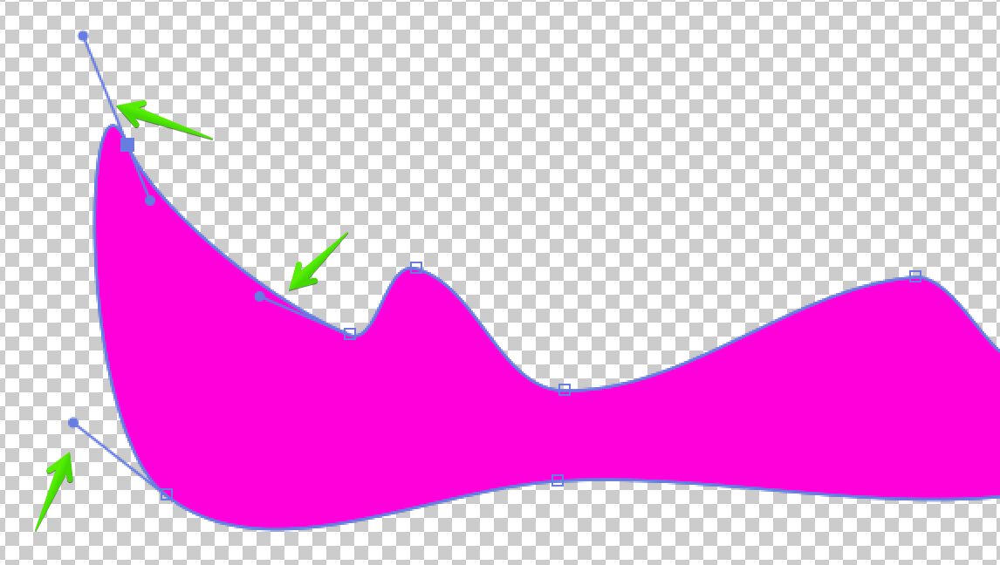

- We can make the tangent on the line segments independant if we need to. With the pen tool selected, also the `Converge Vertex Tool` option added we can change the tangents. 

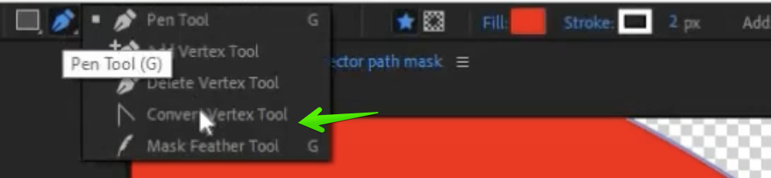

- Now we have this rather abstract shape that has been created we next convert it to a realtime based item, change the label to realtime and run the realtime script. 
!!! warning 
    has the above been added as a feature? 

### Adding a Mask

We can add a `mask` as an option also, how do we do that? 

!!! info "What is a mask?"
    Masks can be a path or outline used to modify layer effects and attributes. In After Effect, a mask is often a shape that reveals or conceals a particular region of a layer in your composition. You can use masking to hide or reveal a portion of a layer or an object. An item, such as text, may first be covered by a mask in an animation before the mask slides out to reveal the object. Alternatively, you can have them stay still in the picture and crop out unwanted features.

- Add a rectangle real time shape to the canvas, covering the vector shape 
- Make sure the z-roder is correct, top should be the vector shape, lower should be the rectangle shape layer

!!! warning 
    make sure it is a seperate layer and not a sub layer of an existing shape in your composition. 

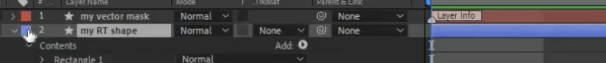

- Label the new rectangle shape as a realtime item 
- Next, make the vector shape a track matte mask of the rectangle shape layer.

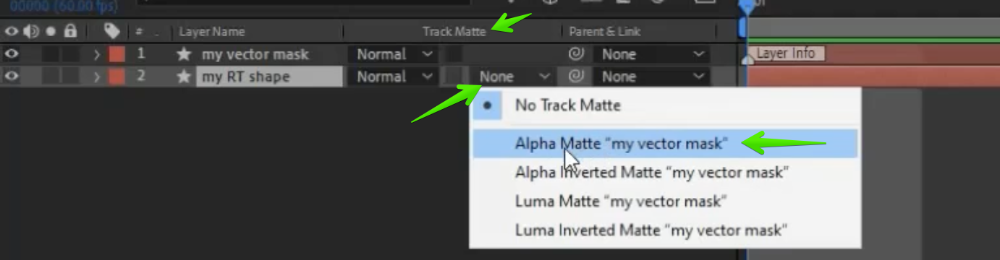

!!! note 
    alpha matte is option that is supported at this point in time. 

!!! info "What is a Trac Matte Mask?"
    What are Track Mattes in After Effects? To put it simply, a track matte is a still image, video clip, graphic, piece of text or shape used to create a variable transparency in another layer within your motion graphic design. The track matte carves out a portion of a layer, exposing the layer beneath i

!!! warning 
    there is dependancy on using the realtime object script that has been built for this feature in March 2021. This was `realtime-objects-script.2.1.0.24. Earlier scripts will not work. 

- Render the comp, create a layout in Creation Station, add the .mov. 

!!! note 
    you will see any realtime tags in the creation station as we have previously, this is just a shape.

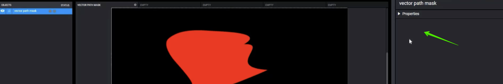

- Review the item on the CSL output and the output should be the same as the shape created in After Effects.

### Animated Real Time Shapes and Masks

The path can be animated as can the transform. 

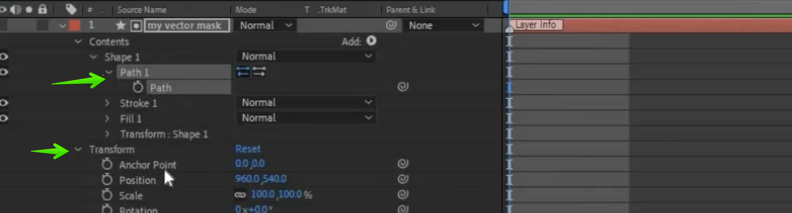

#### Animation of the Path

- Add key frames on the time line for the vector path 

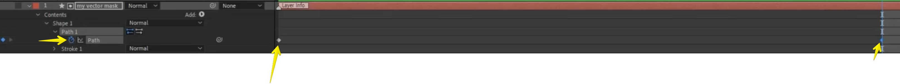

 - On that the last key (example) switch to the pen tool with the `convert vertex tool` opted for. 

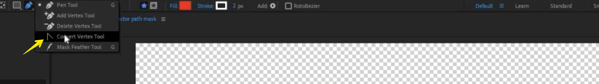

- Modify the tangents
- Switch back to the normal pen tool mode and then adjust the vertex. 
- When you play the timeline, you should have some similar to below:

- Run the real time script again, render the composition and upload to a layout in creation station. 

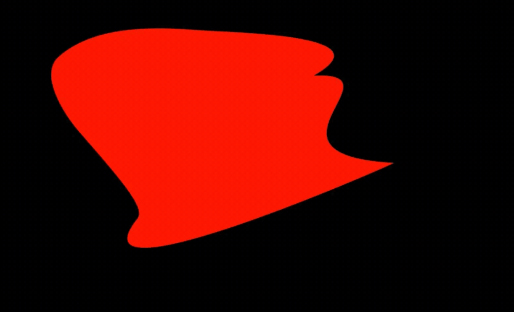

