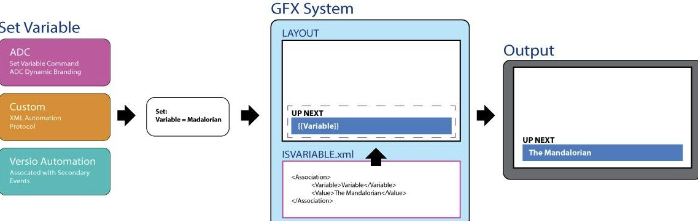
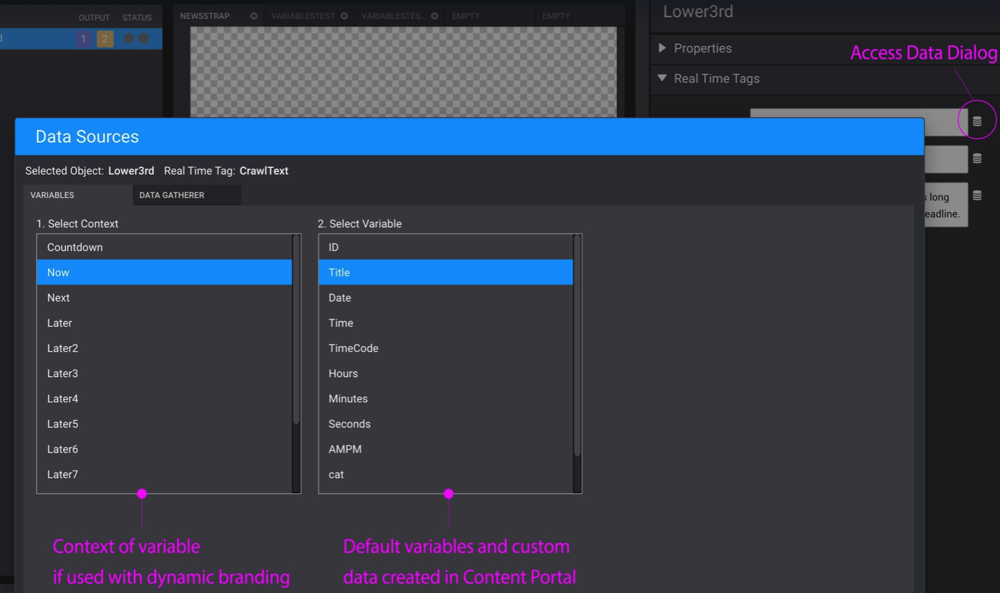
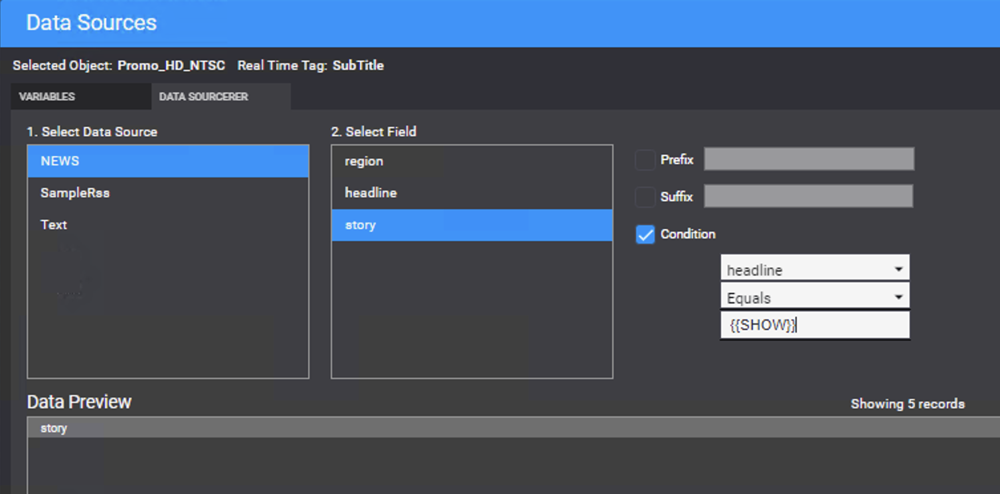
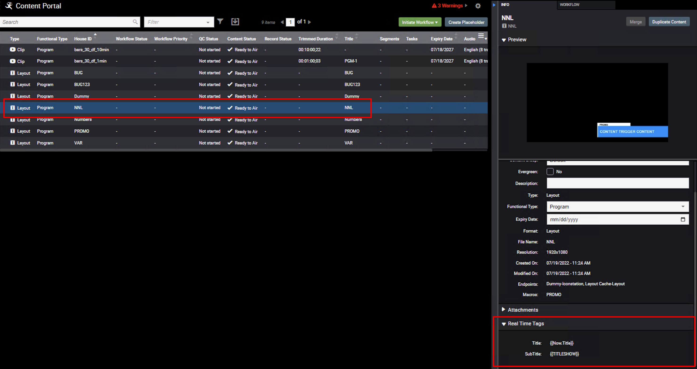

<!--
Title : tut_versio_graphics_variables
- Created : 2022-07-19
- Updated :
- Author : James Rivers
- Written against (version):
- Sources :
- Author Notes :
- Tags : 
-->


# Reference - Variables in Versio Graphics

A variable is a dynamic storage location for data in the context of a graphics instance, though sometimes also within the context of only one layer. 

It's updated from outside a graphics instance and it is also 'primitive', meaning it holds only a string rather than a series of records or a structure.

This allows external systems to update a variable that is used by a layout/element instead of physically updating the layout itself. It also permits the system to update values on air and allow the designer to craft how they want that update to look. 

Variables get written and read from `C:\Program Files (x86)\Harris\Versio Graphics\ISVariable.xml` on the graphic system. This file should not be edited manually. 



## Creating Variables 

A variable is super easy to to create. In Versio Graphics, simply choose an existing variable or create your own custom variable. 

On any Real Time Field in Versio Graphics select the “Data” icon to the right of the field


!!! note
    This could be the default string when an MOV is exported from After Effects.

This will open your Data Sources dialog. In the Variables Tab, select a pre-existing variable. The Context (Now.Variable, Next.Variable) are to be used with Dynamic Branding supported by ADC and Versio Automation.



### A Custom Variable

Alternatively, users can just write in any custom variable they would like. Obviously, there will have to be communication with other systems to ensure this variable gets set. This can be done with our without context. 

A variable is defined buy using double opening and closing curly braces. `{{Variable}}`

!!! info
    Note you can combine variables and strings together to create a dynamic string within static text.
    Coming Up {{SHOW}}!
    More {SHOW}} coming up next!


#### Using Variables as a look up in a Data Source

Use Variables in conjunction with Data Sourcerer as a lookup in another table. Simply enter the variable as a condition in your data source to display a record in a column where another column equals the value of your variable.



### How to set variables 

Variables can be set in multiple ways based on your toolset. 

#### XML Protocol 

XML automation protocol can be used to set variables. This method is what is employed under the hood in ADC and other systems.  
```xml
<?xml version='1.0' encoding='UTF-8' standalone='yes'?>
<Inscriber-IconStation-Request><Version>3</Version>
<ID>216a6fe6-5b9c-462a-b341-50acb0dac695</ID>
<Command>set variables</Command>
<Parameters>
<Properties>
<Association>
<Variable>spaghetti</Variable>
<Value>The Mandalorian</Value>
</Association>
</Properties>
</Parameters>
</Inscriber-IconStation-Request>
```

Insert ADC Commands Here ... 

### Vesio Automation and Variables

Versio Automation is built to handle variables (4.5) natively. As of this version there are things you need to know:

- Variables are sent with Graphic Secondary Events
- Default variables are sent/updated with every graphic secondary for every context (Now, Next, Later…)
   - ID
   - Title
   - Date
   - Time
   - TimeCode
   - Hours
   - Minutes
   - Seconds
   - AMPM
   - Any Custom Tags created in Content Portal

> Note that Custom layout variables are only sent with that specific secondary event.

### Custom variables in action....

- Create a new layout with RTO enabled objects
- Edit the Real Time Tags
   - Add your custom variable - `{{TITLESHOW}}` (as example) 
- Publish this layout - it goes to the central layout cache
- Open Content Portal and review the layout and details you have created



- Open Versio Automation schedule this new layut as a seconday event
- Operatiors can edit this field manually if requried
   - It is more likely that traffic via the Veriso integration service with rules who would be updating the field `{{TITLESHOW}} {{DATA}}'

In the the below example we have the `now.title` assigned as well as the custom variable `TITLESHOW` 
- The `now.title` will be populated by the schedule as this is part of NNL. 
- The custom vairable we have updated - but traffic can also perform this function. 
- Note the Primary event title is `PGM1'
- The next event title is `PGM2` 

See how the NNL - now.title is automatically updating. 

See how the custom variable is updating, yet we are still using the same layout and macro. 


