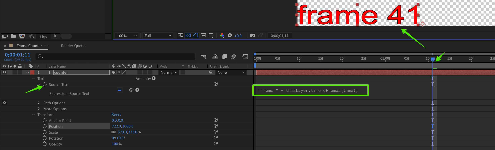

---
tags:
  - realtime
  - expression
  - frame counter
  - tutorial
---

<!--
Title : tut_frame_counter
- Created : 2022-10-28
- Updated :
- Author : James Rivers
- Written against (version):
- Sources :
- Author Notes :
-->

!!! info "Article Updated"
    Fri 28 Oct 2022 15:18:09 BST
# Tutorial - Frame Counter

This a short and snappy tutorial to generate a frame counter that we will use the other sessions. 

## Session objectives

- Create a new comp 
- Add a text layer 
- Add the expression you can see below to the source text

!!! info
    Open the layer properties, hold “Alt”(PC) or “Option” (Mac), and click on the stopwatch of the property you want to apply the expression to. In the timeline under the layer, a text box will appear and the numeric parameters will turn red. Here you will type or paste the expressions.

```js
"frame " + thisLayer.timeToFrames(time);
```



!!! info
    why did we create this? Great question, there are a number of layouts in the realtime world that use something call `hybrid` pause. Keep this expression safe and to one side, we will use this as go through other sessions. 

