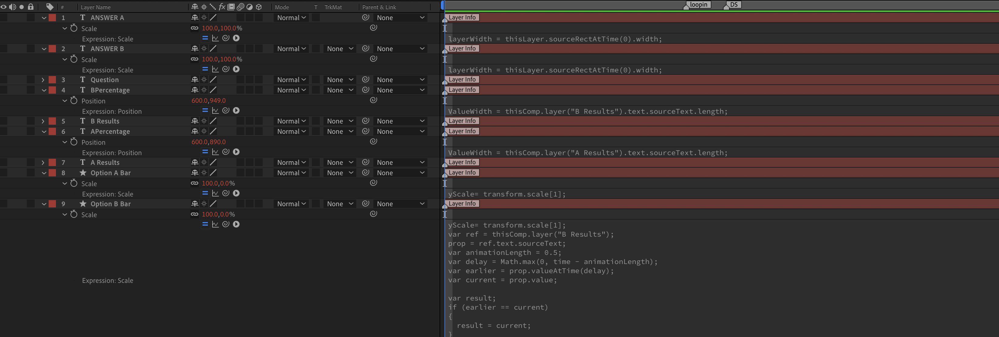

---
tags:
  - realtime
  - polls
  - tutorial
---


<!--
Title : tut_realtime_pull_polls
- Created : 2022-10-28
- Updated :
- Author : James Rivers
- Written against (version):
- Sources :
- Author Notes :
-->

!!! info "Article Updated"
    Fri 28 Oct 2022 12:32:54 BST
# Tutorial - Real Time Data and Polls 

In this tutorial we will extend the real time training and look into another area such as live polls. This is nice tutorial that links the 2 worlds of real time and expressions together... yes I said expressions, more on that to come. 


In this session you will require the following:

- [RealTime_Poll.aep](../../downloads/202210281232_tut_realtime_pull_polls/RealTime_Poll.aep)

## Session objectives

- Open the example AEP
- Review the composition, note the number of realtime items in this composition. But also review the expressions used in this compisition. 

!!! tip 
    How to add an expression? How to view the expressions? Tip - we can see all key frames in a comp by using the `u` key and we and all use a quick double tap of the `e` key to view all expressions in a comp, nice!



- Once you have reviewed the composition, render and upload to a new layout. 
- Review the layout in Creation Station and edit the external data values and review the on air impact. 


There are a number of expressions used in this comp.  The most important 2 are the `Options Bars` 

```js
yScale= transform.scale[1];
var ref = thisComp.layer("A Results");

prop = ref.text.sourceText;
var animationLength = 0.5;
var delay = Math.max(0, time - animationLength);
var earlier = prop.valueAtTime(delay);
var current = prop.value;

var result;
if (earlier == current)
{
  result = current;
}
else
{
  function binarySearchUpdate(prop, ts, te, vs, ve, iterations)
  {
    for (var i = 0; i < iterations; i++)
    {
      var tm = (ts + te) /  2;
      var vm = prop.valueAtTime(tm);
      if (vm == vs)
      {
        ts = tm;
      }
      else if (vm == ve)
      {
        te = tm;
      }
      else
      {
        // value changed more than once...
        return 0;
      }
    }
    return (ts + te) /  2;
  }

  var tstart = binarySearchUpdate(prop, delay, time, earlier, current, 10);
  var tend = tstart + animationLength;
  var vstart = parseInt(earlier);
  var vend = parseInt(current);
  var interpolated = linear(time, tstart, tend, vstart, vend);
  result = Math.round(interpolated);
}

[yScale,result]
```
