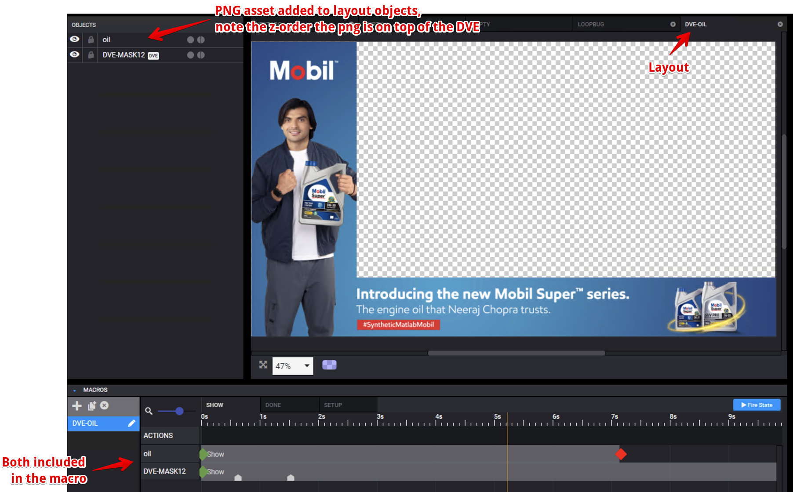
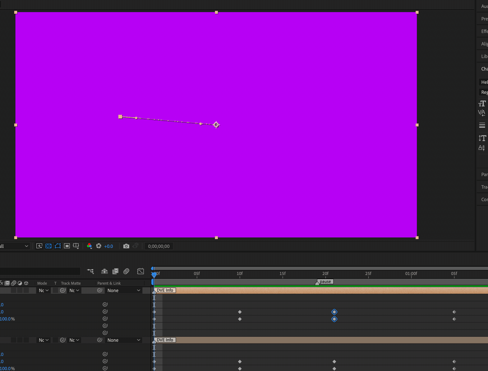
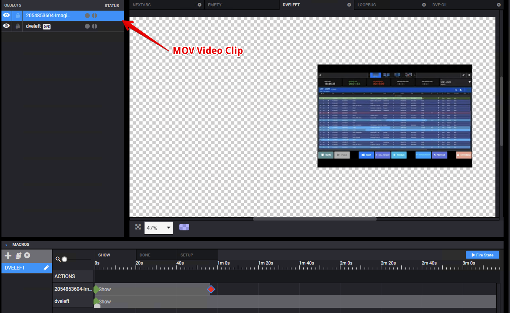

---
tags:
  - dev
  - how to
---

<!--
Title : 2122916070_build_dve_howto

- Created : 2022-01-08 20:42
- Updated :
- Author : James Rivers
- Written against (version):
- Sources : Versio 4.6 System Operations
- Author Notes :
- Tags : [!versio_graphics_moc](../../!versio_graphics_moc.md)
-->
!!! info "Article Updated"
    Sun 30 Oct 2022 20:47:24 IST

# How to build a DVE

In After Effects  create a composition to match your output framerate. 

!!! note
    Compositions can be cropped or full screen. Plus remember to trim composition timelines to work area. 

!!! info
    Scripts parse the entire timeline and not just the time ruler.

## CTC 
 You will have covered CTC - Triggers in a  previous chapter. We are going to be using some again in this project. 

 - Firetrigger - Ability to fire a trigger from within a MOV
 - Triggergoto - On a specified trigger, jump to a specific label within the MOV
 - kill -  Good practice to kill the animations when they are DONE - Clear up after yourself!
 - DVE Triggers 
	 - Duck audio on a specific frame for a set duration
	 - Change the DVE z-order (Source A, Source B, GFX)

## DVE Script

In previous chapters we have covered the use of Scripts with Real Time objects.  Those scripts reviewed the composition and worked on those layers that had a label of a certain syntax, Realtime, Time, Scroll.

The DVE script does not use a label, insteaad the layer is going to be called either:
- `DVE A`
- `DVE B`

You must use that to name the layers. 

## Build - Single DVE

Enough waffle - lets build.  In the comp add 2 new solids, give them differing colors, this will help later.  Name 1 sold `DVE A` and the other `DVE B`

!!! tip
    I know we are building a single DVE, so why do we have 2 solids A & B?  the Versio Graphics engine on playout needs to understand that there are A & B, even though we are going to perform a single DVE.  

!!! note
    DVE A and DVE B are the names that are listed in the Zenium blueprint found on your Versio - hence the names we use here.

In your composition make sure A is over B - that is default state on the Versio.

As we are doing a single DVE on `DVE A` make the `DVE B` solid a 100% opacity at the beginning of the comp, just case something is loaded in the preset on the Versio we don't need to see it in the DVE.

Next we want to move onto creating the animation. 

- Frame 1 add keyframes for position and scale on `DVE A`
- Go forward so many frames in the timeline
- Position the solid

!!! note
    You can play with - position, scale, roatation and opacity

- Add a pause comp marker a few frames after the animation
- After the pause comp start build your aniimation back out

- **Remember** once you have finished the animation, you must leave `DVE B` in a good state, so put back the opacity. 
- lastly add an end comp marker - `kill = this`  at the end of your timeline to eject this item. 

!!! warning 
    Once you have completed your DVE - run the DVE script and render the compostion. 

Finally take the .mov you have created and add this to a Layout in Creation Station.

### Adding Graphics to this simple single DVE 

!!! note
    If you want to add a realtime directly to this DVE composition, you should read the article `Single DVE - Inverted Track Matte Mask - Real Time`

With DVE you have added to a layout, we are next going to add graphic and or video file to the same layout.  Here is an example, we have a layout called DVE-OIL, the .MOV file that was created for the DVE has already been added. 

Next we are going to add or PNG to the same layout, and making sure that the png asset is added to the macro along with the DVE. 

Operations would load this layout/macro to their schedule and the DVE along with the asset oil will show. We can added other items to the layout, such as audio also if that was an item we needed. 

!!! note 
    Note in this model, we would have to create a layout for each differing promo as the PNG promo asset is part of the layout / macro.If we wanted the png promo to be realtime then we should review how that is done in the article `Single DVE - Inverted Track Matte Mask - Real Time`.

### Adding Video Clips to this simple single DVE

Created a slightly differing postion and scale for the DVE. 

Created a new layut and now added to that layout a .mov video file as shown below, note that this is a 50 second mov file, so it is not short!

!!! warning
    You must use a supported video format for your embedded video clips in the layouts - `.mov Animation, H.264`. See more supported details on the `Supported Standards & Formats` article. 

Here is the sampleof the dve with the embedded video clip on output:

