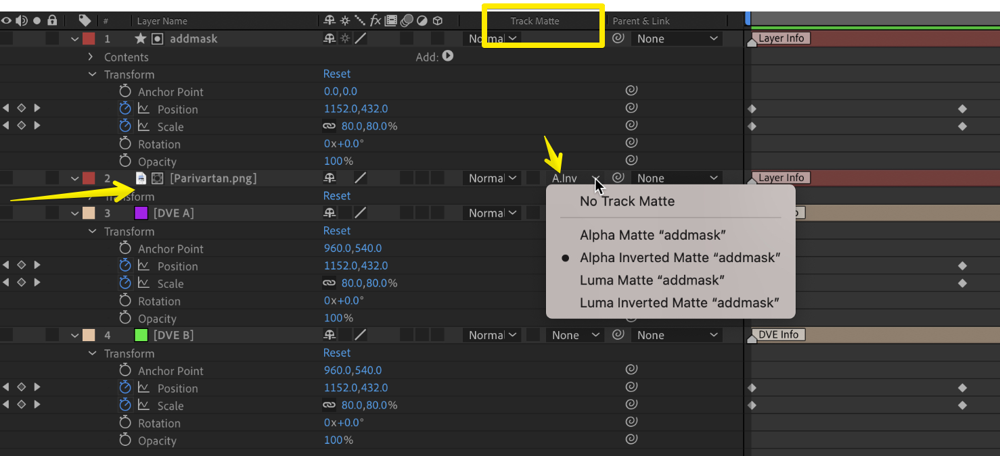
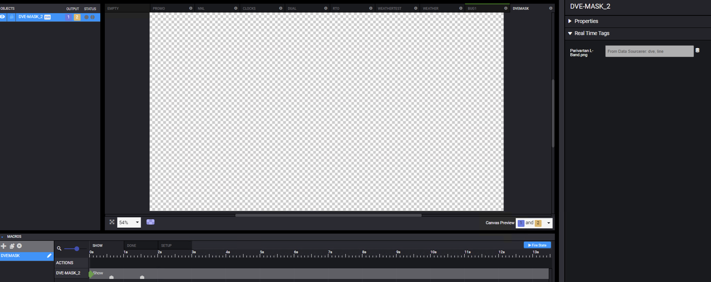
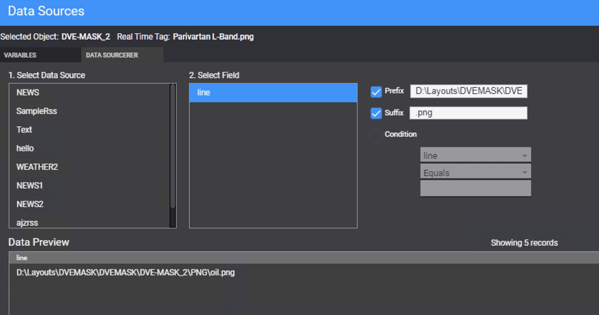

---
tags:
  - dve
  - realtime
  - track matte
  - mask
---


<!--
Title : tut_dve_inverted_track_matte_mask_realtime_png
- Created : 2022-11-01
- Updated :
- Author : James Rivers
- Written against (version):
- Sources :
- Author Notes :
-->

!!! info "Article Updated"
Wed  7 Sep 2022 12:38:32 BST

# Tutorial - Single DVE - Inverted Track Matte Mask - Real Time 

I need to solve the following: 

- Perform a Single DVE
- Keep existing channel logo on air not part of squezze
- Have the promo linked as real time item

So, if we need to keep the channel logo on air and not part of the squeeze then we need to keep the G/A/B setup. `Graphics` on top of `Source A`, on top of `Source B`.


## After Effects Composition 

Lets start with the After Effects composition, first and walkthrough it.


- Add your 2 solids for `DVE A` and DVE B`. 
   - `DVE A` on top of `DVE B`
- Edit your keyframes for geometry - Postion and Scale
- Add your real time image, on top of `DVE A` - set label to `RealTime`
- Add a shape layer - Rectangle, on top of the `RealTime` image
- Rename this shape layer to something that makes sense, me I called it `addmask`

!!! tip
    deselect all layers, then double click the shape rectangle tool - this will add a new shape layer that fills the entire compostion frame

- Set this shape layer to be also a `RealTime` label
- Copy the keyframes from `DVE A` and place on the new shape layer, so they match
- Add and inverted track matte mask on the image layer, linked to the `addmask` layer  



Run the `RealTime` script followed by the `DVE` script. 

Make sure you have added all the compostion markers that you need.

!!! note 
    Please make sure you do add a comp marker to end - kill = this.

Once completed, render the composition. 

## Creation Station Items

Create a new layout, add the DVE render .mov file to the layout.  



Next I need to added some logic to make this DVE template usable again and again. 

The real time image item, I am linking to a data source. A simple text file data source.  



Plus I am adding a prefix and suffix to this data source. 

- Prefix is path to image
- Suffix is file extension - .png

## Data Sourcerer

Added new data source for a text file:

```ps
 Invoke-RestMethod http://localhost:6474/api/sources `
        -Method POST `
        -ContentType "application/json" `
        -Body `
@"
{
    "name": "dve",
    "providerConfiguration": {
        "type": "5",
        "Path": "C:\\DataSources\\dve.txt"
    }
}
"@
 
```
Pulled this data source and added to the data sourcer data set. 


### Execution 

Operational method:

- Raw data text file is edited, example `car'
- DVE is taken to air 


### Can we do video files rather than images 

Yes, video files will work for the real time item. 

