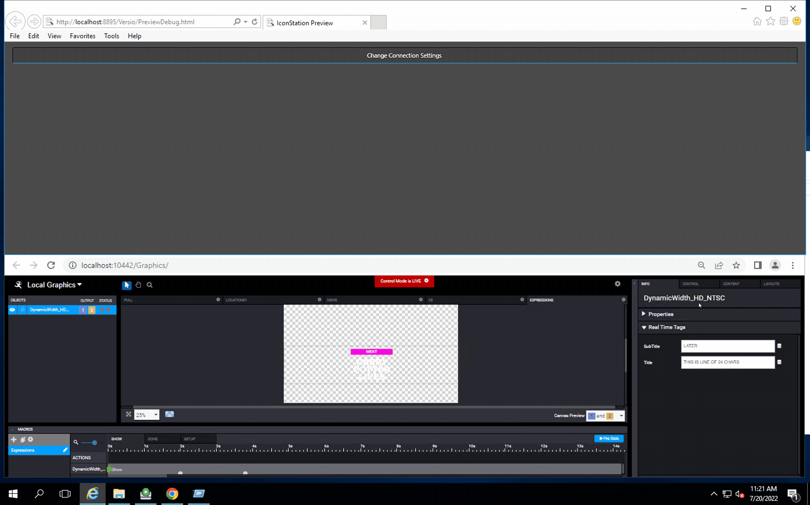
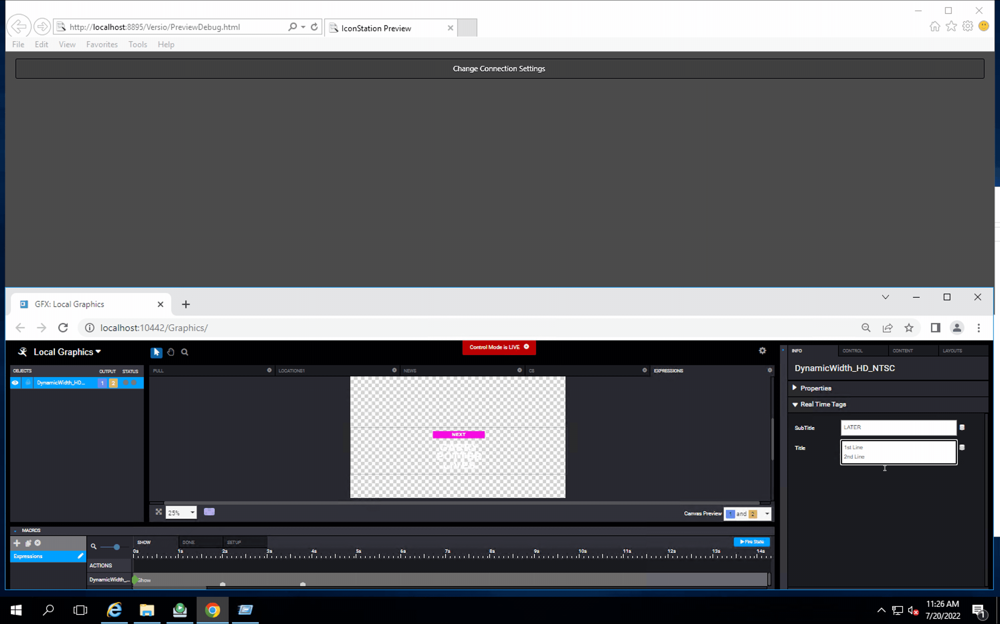
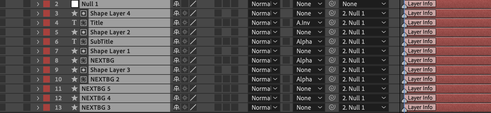
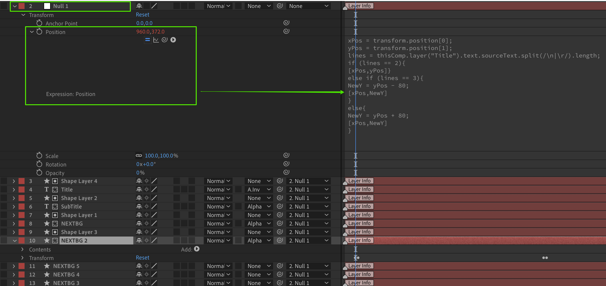

<!--
Title : tut_dynamic_text_width
- Created : 2022-07-20
- Updated :
- Author : James Rivers
- Written against (version):
- Sources :
- Author Notes :
- Tags : 
-->


# After Effects Expresssion - Dynamic Width

This article will briefly review a dynamic width expression that can be used in the Versio Graphics World.  Befoew we look at the AE composition, lets review what we are accomplishing here. 

Here we have a single line of 24 characters that we are then going to shorten to 16 characters. Notice the dynamic state of the later banner and text we are seeing. 



What about if we use more than 1 line, say 3 or 4. Sure we can do that here.



## After Effects Comp Review 

Here we have the comp for review - please download the comp so you can also review. 

[ch8_expression_dynamic_width.aep](docs/downloads/ch8_expression_dynamic_width.aep)



So we have a huge number of Real Time Objects,  Masks, Shapes and Text layers. To make your building simple here everything is linked to a parent `null1`. It is within `null1` that you will find the expression in which the magic happens for the postion, lets take a look.  We also have lots of other expressions dclared here on the differing layers that we will also showcase here.



## Expression review

> Tip - we can see all key frames in a comp by using the `u` key and we and all use a quick double tap of the `e` key to view all expressions in a comp, nice.


Null layer

```
xPos = transform.position[0];
yPos = transform.position[1];
lines = thisComp.layer("Title").text.sourceText.split(/\n|\r/).length;
if (lines == 2){
[xPos,yPos]}
else if (lines == 3){
NewY = yPos - 80;
[xPos,NewY]
}
else{
NewY = yPos + 80;
[xPos,NewY]
}
```

Title Layer 
```
line = 22;
txt = value;
len = text.sourceText.length;
if(len<= line){
txt
}
else{
var processed = '';
var breakChar ='\r';
while (txt.length > line){
var subStr = txt.substr(0,line);
var lastSpaceIndex = subStr.lastIndexOf(" ");
processed += txt.substr(0,lastSpaceIndex) + breakChar;
txt = txt.substr
(lastSpaceIndex + 1);
}
txt = processed + txt;
}
```
NextBG Layer
```
xS = transform.scale[0];
yS = transform.scale[1];
tL = thisComp.layer("Title").sourceRectAtTime().width;
stL =  thisComp.layer("SubTitle").sourceRectAtTime().width;
if (tL >= stL){
nW = (tL/1920)*100 + 3;
baseWidth = Math.min(Math.max(nW, 0), 65);
[baseWidth,yS]
}
else {
nW = (stL/1920)*100 + 3;
baseWidth = Math.min(Math.max(nW, 0), 60);
[baseWidth,yS]
}
```
NextBG 2 Layer 
```
xS = transform.scale[0];
yS = transform.scale[1];
tL = thisComp.layer("Title").sourceRectAtTime().width;
stL =  thisComp.layer("SubTitle").sourceRectAtTime().width;
if (tL >= stL){
nW = (tL/1920)*100 + 3;
baseWidth = Math.min(Math.max(nW, 0), 65);
[baseWidth,yS]
}
else {
nW = (stL/1920)*100 + 3;
baseWidth = Math.min(Math.max(nW, 0), 60);
[baseWidth,yS]
}
```
NextBG Layer 
```
xS = transform.scale[0];
yS = transform.scale[1];
tL = thisComp.layer("Title").sourceRectAtTime().width;
stL =  thisComp.layer("SubTitle").sourceRectAtTime().width;
if (tL >= stL){
nW = (tL/1920)*100 + 3;
baseWidth = Math.min(Math.max(nW, 0), 65);
[baseWidth,yS]
}
else {
nW = (stL/1920)*100 + 3;
baseWidth = Math.min(Math.max(nW, 0), 60);
[baseWidth,yS]
}
```

NextBG 4 Layer 
```
xS = transform.scale[0];
yS = transform.scale[1];
tL = thisComp.layer("Title").sourceRectAtTime().width;
stL =  thisComp.layer("SubTitle").sourceRectAtTime().width;
if (tL >= stL){
nW = (tL/1920)*100 + 3;
baseWidth = Math.min(Math.max(nW, 0), 65);
[baseWidth,yS]
}
else {
nW = (stL/1920)*100 + 3;
baseWidth = Math.min(Math.max(nW, 0), 60);
[baseWidth,yS]
}
```
NextBG 5 Layer 
```
xS = transform.scale[0];
yS = transform.scale[1];
tL = thisComp.layer("Title").sourceRectAtTime().width;
stL =  thisComp.layer("SubTitle").sourceRectAtTime().width;
if (tL >= stL){
nW = (tL/1920)*100 + 3;
baseWidth = Math.min(Math.max(nW, 0), 65);
[baseWidth,yS]
}
else {
nW = (stL/1920)*100 + 3;
baseWidth = Math.min(Math.max(nW, 0), 60);
[baseWidth,yS]
}
```


