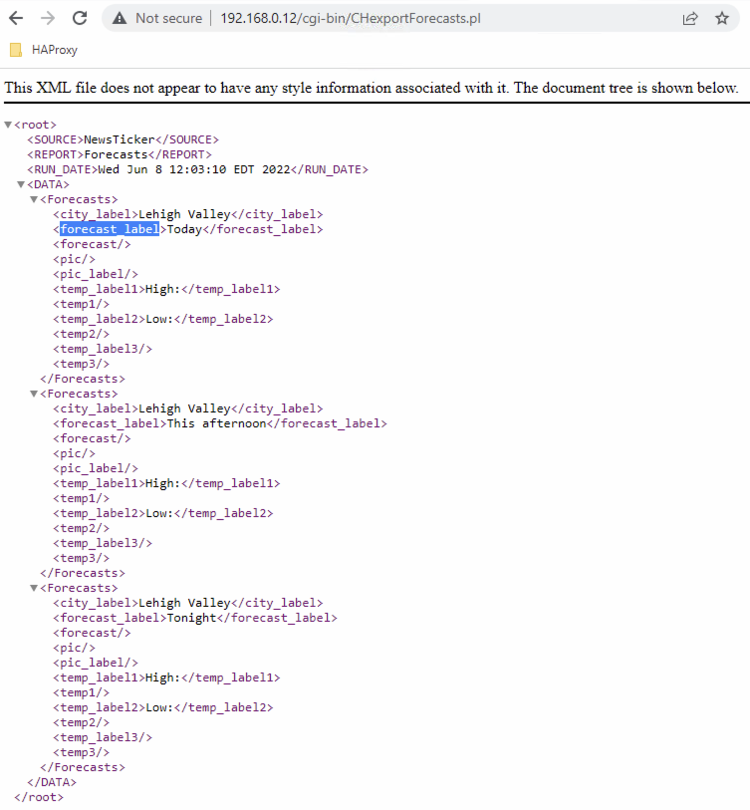

<!--
Title : how_data_sourcerer_management
- Created : 2022-06-07
- Updated :
- Author : James Rivers
- Written against (version): 4.6
- Sources : TechGuides, Confluence, Learning
- Author Notes :
- Tags : 
-->

## Registering a new Data Source
You must register data `sources` before the Versio Graphics component is able to use them. Like all the other methods for interacting with `Data Sourcerer`.

This must be done by creating a Powershell file (at this moment in time)

This file will contain a reference to the location that contains the data (for example, a TXT file or an RSS feed), along with any properties for defining the source.

Here is a sample
```ps
Invoke-RestMethod http://localhost:6474/api/sources `
    -Method POST `
    -ContentType "application/json" `
    -Body `
@"
{
    "name": "Test",
    "providerConfiguration": {
        "type": 5,
        "HasHeaderRecord": false,
        "Path": "C:\\ds\\test.txt"
    }
}
"@
```

Some of the parameters in this script are standard for a REST interface, and you can get more information by using Swagger software for exploring the Data Sourcerer API. The following parameters are ones that you will need to edit in order to register your data source. 

Lets break down the information in listed in the `body` section. 

- name 
	- This is the name that Data Sourcerer will use to identify the data source within Versio.
- type 
	- This is the type of data source you are registering, based on the format of the source file. 
	- 3: CSV
	- 4: RSS 
	- 5: TXT 
	- 6: SQL 
	- xml:XML
- HasHeaderRecord 
	- Whether the first line of the file contains header text. This is not applicable to RSS or SQL sources. 
- Delimiter 
	- The character that is used as a delimiter. This is only applicable to CSV sources. Exmaple `,` `:`
- Path 
	- The path to the data source file or feed. Note: This is not applicable to SQL sources. 
- columns 
	- Use this parameter to specify the names of the columns. These are column names that will appear in Versio Platform. 
- Url 
	- This is the connection string used to connect to an SQL database. SQL and Windows authentication are supported. 
- QueryString 
	- The transact SQL query to provide the data. 
- PollingIntervalMs 
	- The time between polling the source (15000 = 15 seconds) 

What follows are examples of the following data source types for review and practice. 

### Adding XML Data Source
In this section we will walk through the steps required to add a new XML based data source. login into the `Core Service` instance that has `Data Sourcerer` installed. 

> Note if you have multiple instances you will have to perform the tasks below more than once. 


1. Open the `PowerShell ISE` application
2. Create a new `.ps` file
3. Add the following syntax to the new file.

```shell
     Invoke-RestMethod http://localhost:6474/api/sources `
        -Method POST `
        -ContentType "application/json" `
        -Body `
@"
{
    "name": "Forecasts",
    "providerConfiguration": {
        "type": "xml",
        "Url":  "http://192.168.0.12/cgi-bin/CHexportForecasts.pl",
        "RowXpath": "//DATA/Forecasts",
        "Fields": [
            {"Name": "city_label", "Xpath": "city_label/text()"},
            {"Name": "forecast_label", "Xpath": "forecast_label/text()"},
            {"Name": "temp_label1", "Xpath": "temp_label1/text()"},
            {"Name": "temp1", "Xpath": "temp1/text()"}
        ]
    },
    "pollingIntervalMs": 10000
}
"@ 
```

Let's walk through this file, the first section is not going to change from 1 source type to another, localhost
```shell
     Invoke-RestMethod http://localhost:6474/api/sources `
        -Method POST `
        -ContentType "application/json" `
        -Body `
@"
```
Next we have: 
 - `name`  This is the name that Data Sourcerer will use to identify the data source within Versio - keep it unique. 
 - `type` What is the data source type? Well as this is an XML type we need to declare that in the form of `xml`
 - `url` What is the url path to the XML data we are searching for
	 - TIP test this in a browser to make sure you can access the data



- `RowXpath` What is the path in the XML that we are going to locate the fields? In the example above, that is `//DATA/Forecasts` we can see this:


- `Fields` What fields do we need to pull from and add to our Versio Data Sourcerer? 

- `Polling Intervel` The time between polling the source (15000 = 15 seconds) - How often shall we poll the source for an update of the data that we are are going to pull. 

4. Save the PS file 
5. Run the PS file


### Adding CSV Source

```sh
 Invoke-RestMethod http://localhost:6474/api/sources `
        -Method POST `
        -ContentType "application/json" `
        -Body `
@"
{
    "name": "NEWS",
    "providerConfiguration": {
        "type": 3,
        "delimiter": ":",
        "HasHeaderRecord": true,
        "Path": "C:\\DataSources\\news.csv"
    },
    "filterConfiguration": {
        "columns": [
            "region",
            "headline",
            "story"
            ]
         }
}
"@  

```

Walkthorugh on this csv data collection:

- name - the name of the data source you are adding.
- type 3 = csv type
- delimiter - what is going to seperare the data in the csv a `,` or  a `:` you get the idea....
- hasheaderrecord - is there a top row header
- path - path to the csv from the data sourcerer service
- filterconfiguration  - what data are we interested in gettting from the data source.

### Adding RSS Source
```sh
    Invoke-RestMethod http://localhost:6474/api/sources `
        -Method POST `
        -ContentType "application/json" `
        -Body `
@"
{
    "name": "SampleRss",
    "providerConfiguration": {
        "type": "rss",
        "Url": "https://www.reddit.com/.rss"
    },
    "filterConfiguration": {
        "columns": [
            "Title",
            "Content"
        ]
    },
    "pollingIntervalMs": 15000
}
"@
```

Walkthrough the RSS data collection - 

- name - your name for the source
- type - 5 = rss
- url - link to feed
- filterconfiguration  - what data are we interested in gettting from the data source.
- pollinginteval -  The time between polling the source (15000 = 15 seconds)
 

### Initial Pull from Data Source
Once the `source` is added, we need to `pull` from that source. You must send a pull request to Data Sourcerer before Versio Platform can use your registered source.

```shell
Invoke-RestMethod http://localhost:6474/api/sources/Forecasts/pull `
 -Method POST
```

The script must contain the correct address of the system running Data Sourcerer (or "localhost") and the `name` of the registered source (in this example, "Forecasts"). 

When you run this script, `Data Sourcerer` retrieves the data from the source file (or feed) and creates a table in its SQL database for it. Then it watches the source for changes, and if a change is detected it will update the table automatically.

Where is this data stored on the core services?  Located on the Core Service instance that you are running the Data Sourcerer we will find the `datasource.db` and the `dataset.db` located at `C:\ProgramData\Imagine Communications\Data Sourcerer`

### Checking the Data pulled
Either installed an application, like DB Browser for SQL lite - downloaded from https://sqlitebrowser.org/dl/


Additionally, if your Creation Station and or Versio Server Graphic engines have been configured to  point towards the `Data Sourcerer` then you can check the available data via the RTO fields in your layouts.


