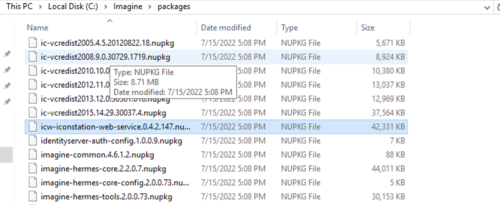
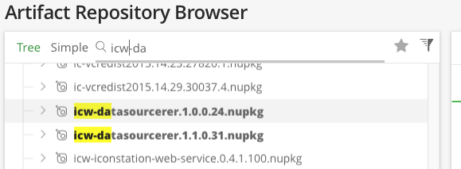
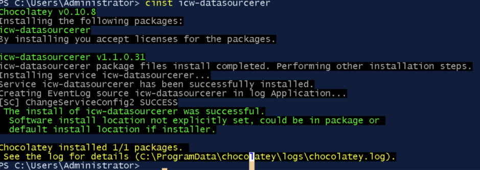
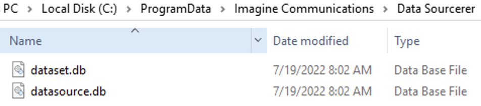
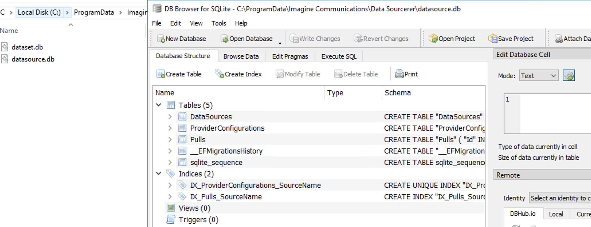

<!--
Title : tut_data_sourcerer_install
- Created : 2022-07-19
- Updated :
- Author : James Rivers
- Written against (version):
- Sources :
- Author Notes :
- Tags : 
-->


# Data Sourcerer Install Guide

The Data Sourcerer will generally be installed on the Shared Services instance in your platform. 

> Note if you have an HA environment you will have more than 1 shared services instances, thus you will need to install and configure the data sourcerer across all those instances. 

## Install on Shared Services 

You will need to install the nupkg `icw-datasourcerer`.

> Note that the `icw-datasourcerer has depdenancies on `srvcwrap` and `versio-common`.

Place the following files in your package source folder:

- icw-datasourcerer
- srvcwrap
- versio-common

The package is not inclucded in the base 4.6 package download.



So you will neend to download this as a seperate okg from the Imagine Artifactroy repo. 



Enter the following command in a Powershell window: choco install icw-datasourcerer Data Sourcerer and its dependencies will be installed.



> Note: You can install Data Sourcerer on a different system if you wish, but be sure to install the Chocolatey framework first, and also set up a choco source on the system. For more information visit http://chocolatey.org

> The basic requirement for a Data Sourcerer system is for .NET core to be installed, and the system must have enough storage available for SQLLite.

You have installed Data Sourcerer on the Shared Services instance. You should find the following now located in the Program Data Directory:



### View the dataset and datasource 

#### SQLLite Browser

I have a tip for you that I suggest you implement, on the shared services install a lite SQL browesr to help you visualize what is located in the datasets. Navigate to https://sqlitebrowser.org/
download and install. 



#### API

Yes there is an api for the Data Sourcer simply use `http://127.0.0.1:6474/api/`


### Set the Infrastructure

Now we have installed the DS on CS we need to connect our Versio Graphics engines to the DS. How?

- On each Versio instance that will be using Data Sourcerer content, you must do the following:
   - Navigate to C:\Program Files\Imagine Communications\Web\Graphics
   - Hold CTRL+SHIFT and right-click the mouse in the Windows Explorer window, then select Open Powershell Window Here.
   - Enter the following command, replacing IPAddress with the Data Sourcerer's IP address:  DataSourceConfiguration_Graphics.ps1 192.168.1.16


```shell
PS C:\Program Files\Imagine Communications\Web\Graphics> .\DataSourceConfiguration_Graphics.ps1 10.0.10.198


    Hive: HKEY_LOCAL_MACHINE\SOFTWARE\Wow6432Node\Inscriber\IconStation


Name                           Property
----                           --------
DataGathererRest

URL          : http://10.0.10.198
PSPath       : Microsoft.PowerShell.Core\Registry::HKEY_LOCAL_MACHINE\SOFTWARE\Wow6432Node\Inscriber\IconStation\DataGathererRest
PSParentPath : Microsoft.PowerShell.Core\Registry::HKEY_LOCAL_MACHINE\SOFTWARE\Wow6432Node\Inscriber\IconStation
PSChildName  : DataGathererRest
PSDrive      : HKLM
PSProvider   : Microsoft.PowerShell.Core\Registry
```


> Warning ⚠️ Using HA? Then use the HA VIP and make sure that the HAProxy is updated to have the Data Sourcerer elements added to the configuration file.

What does this do? It updates the `HKEY_LOCAL_MACHINE\SOFTWARE\Wow6432Node\Inscriber\IconStation`

The script also updates the following:

- `C:\Program Files\Imagine Communications\Web\Graphics\json\config.override.json`

```json
{
    "dgrest":  {
                   "hostname":  "192.168.90.208"
               }
}
```

> System reboot is required after install in order for the data sourcerer data sources to appear in the Prometheus UI.

### Using HA? 

HAProxy.cfg example 
```sh
global
        daemon
        user    haproxy
        group   haproxy
        log     127.0.0.1:514   local0  err

defaults
        maxconn 10000

        mode    http
        option  http-server-close
        option  redispatch
        option  contstats
        retries 3
        backlog 10000
        timeout client 25s
        timeout connect 5s
        timeout server 25s
        timeout tunnel 3600s
        timeout http-keep-alive 1s
        timeout http-request 15s
        timeout queue 30s
        timeout tarpit 60s
        timeout check 3s
        default-server inter 10s rise 2 fall 1
        option  forwardfor

        log     global
        option  httplog

listen stats
        bind    10.26.227.100:1990
        bind    *:1990 v4v6

        stats   enable
        stats   realm DataSourcerer\ Statistics
        stats   uri /
        stats   refresh 5s

# DG frontend
frontend ft-datasourcerer

        bind    10.26.227.100:6474
        bind    *:6474 v4v6

        default_backend bk_datasourcerer


# DG Backend

backend bk_datasourcerer

        balance roundrobin
        option  forwardfor
        option  httpchk GET /api/sources
        http-check  expect  status  200

        server datasourcerer-1         10.26.227.111:6474 check weight 1
        server datasourcerer-2         10.26.227.121:6474 check weight 1
        server datasourcerer-3         10.26.227.131:6474 check weight 1
```      

Service file /unit

```sh
# /etc/systemd/system/datasourcerer.service
  
[Unit]
Description=HAProxy Load Balancer Datasourcerer
After=syslog.target network.target
  
[Service]
EnvironmentFile=/etc/sysconfig/haproxy
ExecStart=/usr/sbin/haproxy-systemd-wrapper -f /etc/haproxy/datasourcerer.cfg -p /run/websocket.pid $OPTIONS
ExecReload=/bin/kill -USR2 $MAINPID
KillMode=mixed
  
[Install]
WantedBy=multi-user.target
```

