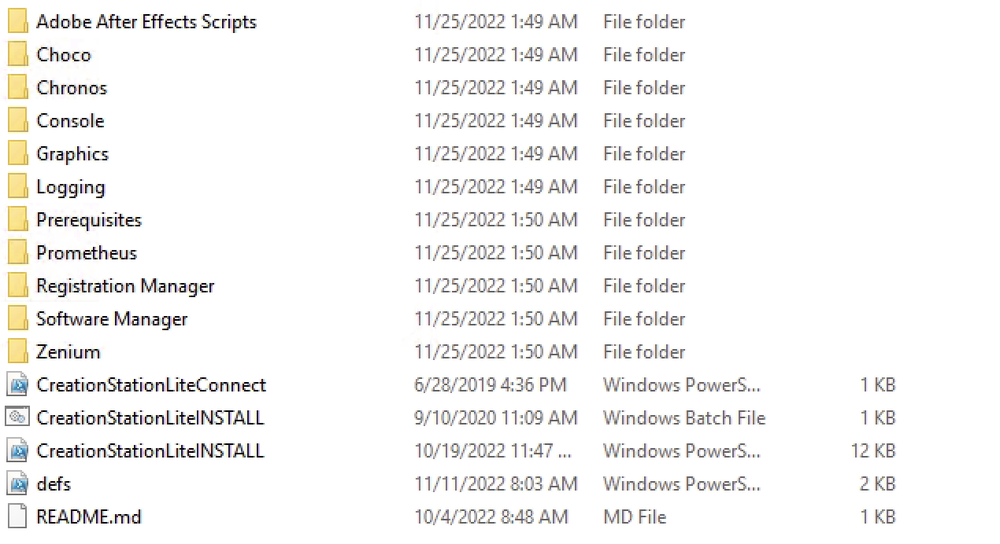
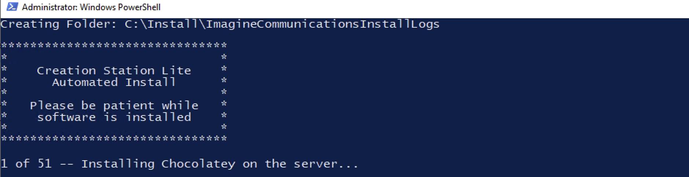
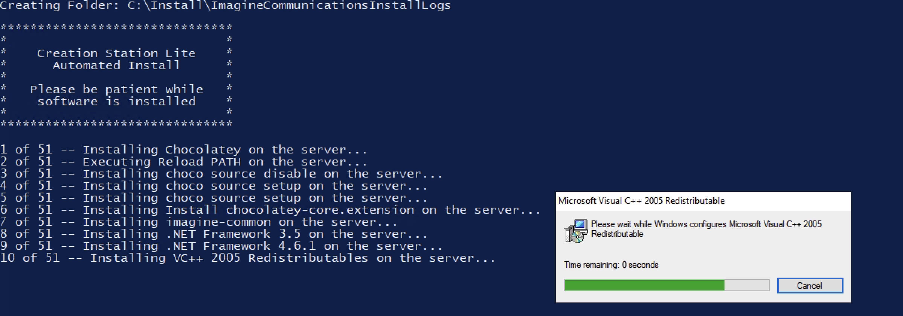
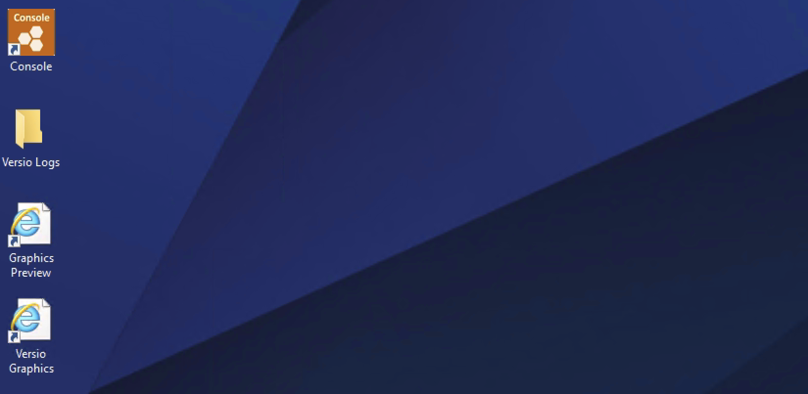
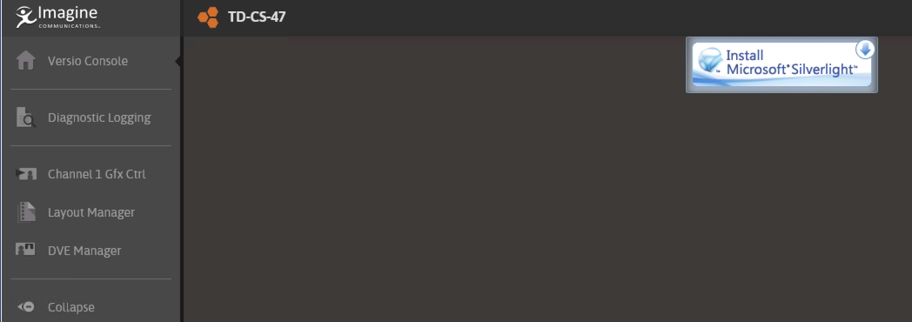
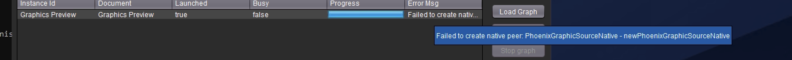
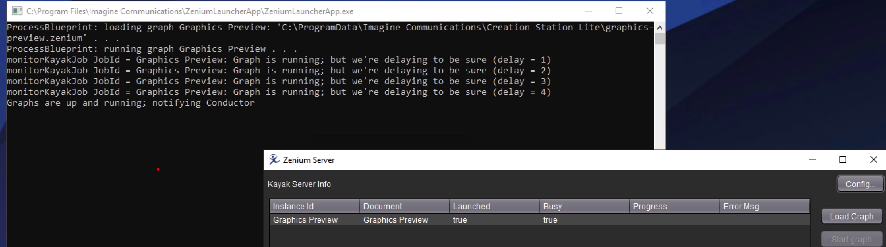

---
tags:
  - creation station
  - web rtc
  - 4.7
  - reference
---


<!--
Title : ref_new_creation_station_4.7
- Created : 2022-11-24
- Updated :
- Author : James Rivers
- Written against (version):
- Sources :
- Author Notes :
-->

!!! info "Article Updated"
Written by James Rivers - Thu 24 Nov 2022 14:36:07 GMT

# NEW Versio Creation Station 4.7 Reference

There is a new Creation Station version 4.7.#. This article is a record of, the resource requirement, how to install and how to use. 

!!! info
    installer is located at - \\wtlnas1.wtldev.net\Public\Anatolii

!!! info 
    initial review of the installer package is exactly the the same previous versions, run the `CrerationStationLite` install batch script and let the process continue. 



### What is the difference from this version to previous? 

There is a Zenium Blueprint that produces a Web RTC output. This solves the issue of having to use a Silverlight browser for the preview of graphics. 


## Versio Creation Station 4.7 Resource Requirement

I have built a VM machine using the following specifications
- OS - Windows Server 2019
- Memory - 4Gb 
- Cores - 4 
- C:\ 
- D:\ 


Remember the Creation Station 4.3 system requirements docs places the machine specification as:
- Memory - 8Gb 
- CPU - Intel Core i5/i7 or Intel Xeon (E3/E5/E7)
- OS Windows 7 through to Windows 10

!!! warning 
    machine specifications need to be addressed and set. Note I have not listed a GPU in the sandbox system. 


## Install Steps

- Run the installation script from the Administrator shell. The machine will be rebooted a couple of times.
- After the installation finished, launch the License Server Console from the start menu and make sure to activate a valid Zenium License.
- Then layouts can be imported or created into the IconStation.
- To preview the graphic layouts, launch the respective shortcut on the desktop.

51 packages! 





Install completed



Is console needed to set up the IconStation?  Opened Console - Silverlight required. 



But there is nothing we need here and the Magellan Configuration Page has been removed. 

No Chrome installed, would be nice. 

!!! info 
    We should not be installing Chrome, instead use ms edge. 


Zenium licence added, but I am not sure on the feature package to be used. Added the full playout feature package, that is not correct and I would suggest that we need a new package that is listed in the library clearly for the new 4.7 creation station. 


Once licensed - Reboot. 

### Zenium Launcher Application

Yes there is a ZLA, review of the config.json file:

```json 
{
    "LogFolder":  "C:\\Program Files\\Imagine Communications\\ZeniumLauncherApp\\Logs",
    "LogLevel":  "INFO",
    "ClientSettingsProviderServiceUri":  "",
    "DebugMode":  false,
    "NotifyConductor":  true,
    "LaunchDefaultJava":  true,
    "LaunchWorkingDir":  "C:\\Program Files\\Common Files\\Digital Rapids\\Kayak Server",
    "LaunchArgs":  [
                       "-Djava.awt.headless=false",
                       "-Djava.util.logging.config.file=conf/logging.properties",
                       "-Djava.io.tmpdir=C:/TEMP",
                       "-Dkayak.server.bind.address=127.0.0.1",
                       "-Dkayak.server.port=42000",
                       "-Dkayak.server.instance.jvm.default.options=\"-XX:+UseG1GC -XX:+UnlockExperimentalVMOptions -XX:MaxGCPauseMillis=20 -XX:+DisableExplicitGC -XX:+AlwaysPreTouch -XX:G1HeapRegionSize=2m -XX:TargetSurvivorRatio=90 -XX:G1NewSizePercent=70 -XX:G1MaxNewSizePercent=90 -XX:InitiatingHeapOccupancyPercent=20 -XX:G1MixedGCLiveThresholdPercent=40 -XX:ParallelGCThreads=12 -XX:+ParallelRefProcEnabled -XX:SurvivorRatio=8 -XX:MaxTenuringThreshold=15 -Xmx2048m -Xms2048m -XX:ReservedCodeCacheSize=64m -XX:InitialCodeCacheSize=64m -XX:-CreateMinidumpOnCrash -XX:-UseBiasedLocking -Dbrief.log.formatter.show.millis=true\"",
                       "-Dsun.rmi.dgc.server.gcInterval=9223372036854775807",
                       "-Dsun.rmi.dgc.client.gcInterval=9223372036854775807",
                       "-Djava.rmi.server.hostname=127.0.0.1",
                       "-Djava.library.path=.",
                       "-classpath KayakServer.jar",
                       "ca.digitalrapids.kayak.server.KayakServerMain"
                   ],
    "LaunchArgs_commentedOut":  [
                                    "-Dkayak.server.instance.jvm.extra.options=\"-Xloggc:logs/GC-log_%p_%t.log -XX:+PrintGCDetails -XX:+PrintGCDateStamps -XX:+PrintGC -XX:+PrintGCApplicationStoppedTime -verbose:gc -XX:+UseGCLogFileRotation -XX:NumberOfGCLogFiles=10 -XX:GCLogFileSize=100M\""
                                ],
    "PollingIntervalMS":  1000,
    "KayakInstances":  [
                           {
                               "RecreateOnFail":  true,
                               "PluginsFolder":  "c:\\ProgramData\\chocolatey\\lib\\zenium-plugins-csl\\Plugins",
                               "Name":  "Graphics Preview",
                               "Blueprint":  "C:\\ProgramData\\Imagine Communications\\Creation Station Lite\\graphics-preview.zenium",
                               "RestartOnFail":  true
                           }
                       ]
}
```
### Error on Blueprint Launch 

Hit an error on the start of the Blueprint. 



Fixed - VM CPU needed to support AVX.  

!!! info 
    if running on VM make sure you have AVX enabled. I resolved this issue by making VM CPU not KVM64 but Host. 


### Zenium Designer
Is there Zenium Designer on this install so I can review the Blueprint? No. Installed manually! 

```sh
PS C:\Users\Administrator> cinst zenium-designer
Chocolatey v0.10.8
Installing the following packages:
zenium-designer
By installing you accept licenses for the packages.

zenium-designer v1.20.6.4
zenium-designer package files install completed. Performing other installation steps.
Perform package installation for 'zenium-designer'
'Zenium Designer' 1.20.6 will now be installed.
  zenium-designer may be able to be automatically uninstalled.
 The install of zenium-designer was successful.
  Software install location not explicitly set, could be in package or
  default install location if installer.

Chocolatey installed 1/1 packages.
 See the log for details (C:\ProgramData\chocolatey\logs\chocolatey.log).
```
!!! tip
    Zenium Designer needs plugins, CSL installer maps plugins to `C:\ProgramData\chocolatey\lib\zenium-plugins-csl\Plugins` Zenium Designer is looking for plugins at `C:\Program Files\Imagine Communications\SelenioFlex File\Plugins`


### General Notes

!!! warning
    conductor is here also and does NOT behave the same as on the Versio Server. It does not kill the Kayak Server once stopped. 

System performance of the VM:



## Configuration of CSL 4.7

With the Magellan Configuration page removed - how do we configure this CSL to be HD? NTSC?  Located at `C:/programdata/IC/Creation Station Lite/config.json` is our configuration file. The PS script in that directory to apply the settings.


